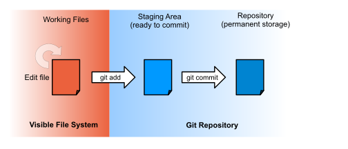

#### Objectives
*   Explain which initialization and configuration steps are required once per machine,
    and which are required once per repository.
*   Go through the modify-add-commit cycle for single and multiple files
    and explain where information is stored at each stage.
*   Identify and Use Git revision numbers.
*   Compare files with old versions of themselves.
*   Restore old versions of files.
*   Configure Git to ignore specific files,
    and explain why it is sometimes useful to do so.

We'll start by exploring how version control can be used
to keep track of what one person did and when.
Even if you aren't collaborating with other people,
version control is much better for this than this:

  
  
"Piled Higher and Deeper" by Jorge Cham, http://www.phdcomics.com

#### Setting Up

The first time we use Git on a new machine,
we need to configure a few things.
Here's how Dracula sets up his new laptop:

~~~
$ git config --global user.name "Vlad Dracula"
$ git config --global user.email "vlad@tran.sylvan.ia"
$ git config --global color.ui "auto"
$ git config --global core.editor "nano"
~~~

(Please use your own name and email address instead of Dracula's,
and please make sure you choose an editor that's actually on your system,
such as `notepad` on Windows.)

Git commands are written `git verb`,
where `verb` is what we actually want it to do.
In this case,
we're telling Git:

*   our name and email address,
*   to colorize output,
*   what our favorite text editor is, and
*   that we want to use these settings globally (i.e., for every project),

The four commands above only need to be run once:
the flag `--global` tells Git to use the settings for every project on this machine.

#### Creating a Repository

Once Git is configured,
we can start using it.
Let's create a directory for our work:

~~~
$ mkdir planets
$ cd planets
~~~

and tell Git to make it a [repository](../gloss.html#repository)&mdash;a place where
Git can store old versions of our files:

~~~
$ git init
~~~

If we use `ls` to show the directory's contents,
it appears that nothing has changed:

~~~
$ ls
~~~

But if we add the `-a` flag to show everything,
we can see that Git has created a hidden directory called `.git`:

~~~
$ ls -a
.	..	.git
~~~

Git stores information about the project in this special sub-directory.
If we ever delete it,
we will lose the project's history.

We can check that everything is set up correctly
by asking Git to tell us the status of our project:

~~~
$ git status
# On branch master
#
# Initial commit
#
nothing to commit (create/copy files and use "git add" to track)
~~~

#### Tracking Changes to Files

Let's create a file called `mars.txt` that contains some notes
about the Red Planet's suitability as a base.
(We'll use `nano` to edit the file;
you can use whatever editor you like.
In particular, this does not have to be the core.editor you set globally earlier.)

~~~
$ nano mars.txt
~~~

`mars.txt` now contains a single line:

~~~
$ ls
mars.txt
$ cat mars.txt
Cold and dry, but everything is my favorite color
~~~

If we check the status of our project again,
Git tells us that it's noticed the new file:

~~~
$ git status
# On branch master
#
# Initial commit
#
# Untracked files:
#   (use "git add <file>..." to include in what will be committed)
#
#	mars.txt
nothing added to commit but untracked files present (use "git add" to track)
~~~

The "untracked files" message means that there's a file in the directory
that Git isn't keeping track of.
We can tell Git that it should do so using `git add`:

~~~
$ git add mars.txt
~~~

and then check that the right thing happened:

~~~
$ git status
# On branch master
#
# Initial commit
#
# Changes to be committed:
#   (use "git rm --cached <file>..." to unstage)
#
#	new file:   mars.txt
#
~~~

mars.txt is now in the index - Git now knows that it's supposed to keep track of this file,
but it hasn't yet recorded any changes for posterity as a commit.
To get it to do that,
we need to run one more command:

~~~
$ git commit -m "Starting to think about Mars"
[master (root-commit) f22b25e] Starting to think about Mars
 1 file changed, 1 insertion(+)
 create mode 100644 mars.txt
~~~

When we run `git commit`,
Git takes everything we have told it to save by using `git add`
and stores a copy permanently inside the special `.git` directory.
This permanent copy is called a [revision](../../gloss.html#revision)
and its short identifier is `f22b25e`.
(Your revision may have another identifier.)

We use the `-m` flag (for "message")
to record a comment that will help us remember later on what we did and why.
If we just run `git commit` without the `-m` option,
Git will launch `nano` (or whatever other editor we configured at the start)
so that we can write a longer message.

If we run `git status` now:

~~~
$ git status
# On branch master
nothing to commit, working directory clean
~~~

it tells us everything is up to date.
If we want to know what we've done recently,
we can ask Git to show us the project's history using `git log`:

~~~
$ git log
commit f22b25e3233b4645dabd0d81e651fe074bd8e73b
Author: Vlad Dracula <vlad@tran.sylvan.ia>
Date:   Thu Aug 22 09:51:46 2013 -0400

    Starting to think about Mars
~~~

`git log` lists all revisions  made to a repository in reverse chronological order.
The listing for each revision includes
the revision's full identifier
(which starts with the same characters as
the short identifier printed by the `git commit` command earlier),
the revision's author,
when it was created,
and the log message Git was given when the revision was created.

> #### Where Are My Changes?
>
> If we run `ls` at this point, we will still see just one file called `mars.txt`.
> That's because Git saves information about files' history
> in the special `.git` directory mentioned earlier
> so that our filesystem doesn't become cluttered
> (and so that we can't accidentally edit or delete an old version).

#### Changing a File

Now suppose Dracula adds more information to the file.
(Again, we'll edit with `nano` and then `cat` the file to show its contents;
you may use a different editor, and don't need to `cat`.)

~~~
$ nano mars.txt
$ cat mars.txt
Cold and dry, but everything is my favorite color
The two moons may be a problem for Wolfman
~~~

When we run `git status` now,
it tells us that a file it already knows about has been modified:

~~~
$ git status
# On branch master
# Changes not staged for commit:
#   (use "git add <file>..." to update what will be committed)
#   (use "git checkout -- <file>..." to discard changes in working directory)
#
#	modified:   mars.txt
#
no changes added to commit (use "git add" and/or "git commit -a")
~~~

The last line is the key phrase:
"no changes added to commit".
We have changed this file in our working tree, but we haven't promoted those changes to the index or saved them as as commit. 
Let's double-check our work using `git diff`,
which shows us the differences between
the current state of the file
and the most recently saved version:

~~~
$ git diff
diff --git a/mars.txt b/mars.txt
index df0654a..315bf3a 100644
--- a/mars.txt
+++ b/mars.txt
@@ -1 +1,2 @@
 Cold and dry, but everything is my favorite color
+The two moons may be a problem for Wolfman
~~~

The output is cryptic because
it is actually a series of commands for tools like editors and `patch`
telling them how to reconstruct one file given the other.
If we can break it down into pieces:

1.  The first line tells us that Git is using the Unix `diff` command
    to compare the old and new versions of the file.
2.  The second line tells exactly which [revisions](../../gloss.html#revision) of the file
    Git is comparing;
    `df0654a` and `315bf3a` are unique computer-generated labels for those revisions.
3.  The remaining lines show us the actual differences
    and the lines on which they occur.
    In particular,
    the `+` markers in the first column show where we are adding lines.

Let's commit our change:

~~~
$ git commit -m "Concerns about Mars's moons on my furry friend"
# On branch master
# Changes not staged for commit:
#   (use "git add <file>..." to update what will be committed)
#   (use "git checkout -- <file>..." to discard changes in working directory)
#
#	modified:   mars.txt
#
no changes added to commit (use "git add" and/or "git commit -a")
~~~

Whoops:
Git won't commit because we didn't use `git add` first - there's nothing in the index and nothing for git to make a commit out of!
Remember to promote our work from the working tree to the index first using 'git add':

~~~
$ git add mars.txt
$ git commit -m "Concerns about Mars's moons on my furry friend"
[master 34961b1] Concerns about Mars's moons on my furry friend
 1 file changed, 1 insertion(+)
~~~

Git insists that we add files to the set we want to commit
before actually committing anything
because we may not want to commit everything at once.
For example,
suppose we're adding a few citations to our supervisor's work
to our thesis.
We might want to commit those additions,
and the corresponding addition to the bibliography,
but *not* commit the work we're doing on the conclusion
(which we haven't finished yet).

To allow for this,
Git has a special staging area
where it keeps track of things that have been added to
the current [change set](../gloss.html#change-set)
but not yet committed.
`git add` puts things in this area (the index),
and `git commit` then copies them to long-term storage (as a commit):

Let's watch as our changes to a file move from our editor
to the staging area
and into long-term storage.
First,
we'll add another line to the file:

~~~
$ nano mars.txt
$ cat mars.txt
Cold and dry, but everything is my favorite color
The two moons may be a problem for Wolfman
But the Mummy will appreciate the lack of humidity
$ git diff
diff --git a/mars.txt b/mars.txt
index 315bf3a..b36abfd 100644
--- a/mars.txt
+++ b/mars.txt
@@ -1,2 +1,3 @@
 Cold and dry, but everything is my favorite color
 The two moons may be a problem for Wolfman
+But the Mummy will appreciate the lack of humidity
~~~

So far, so good:
we've added one line to the end of the file
(shown with a `+` in the first column).
Now let's put that change in the staging area
and see what `git diff` reports:

~~~
$ git add mars.txt
$ git diff
~~~

There is no output:
as far as Git can tell,
there's no difference between what it's been asked to save permanently
and what's currently in the directory.
However,
if we do this:

~~~
$ git diff --staged
diff --git a/mars.txt b/mars.txt
index 315bf3a..b36abfd 100644
--- a/mars.txt
+++ b/mars.txt
@@ -1,2 +1,3 @@
 Cold and dry, but everything is my favorite color
 The two moons may be a problem for Wolfman
+But the Mummy will appreciate the lack of humidity
~~~

it shows us the difference between
the last committed change
and what's in the staging area.
Let's save our changes:

~~~
$ git commit -m "Thoughts about the climate"
[master 005937f] Thoughts about the climate
 1 file changed, 1 insertion(+)
~~~

check our status:

~~~
$ git status
# On branch master
nothing to commit, working directory clean
~~~

and look at the history of what we've done so far:

~~~
$ git log
git log
commit 005937fbe2a98fb83f0ade869025dc2636b4dad5
Author: Vlad Dracula <vlad@tran.sylvan.ia>
Date:   Thu Aug 22 10:14:07 2013 -0400

    Thoughts about the climate

commit 34961b159c27df3b475cfe4415d94a6d1fcd064d
Author: Vlad Dracula <vlad@tran.sylvan.ia>
Date:   Thu Aug 22 10:07:21 2013 -0400

    Concerns about Mars's moons on my furry friend

commit f22b25e3233b4645dabd0d81e651fe074bd8e73b
Author: Vlad Dracula <vlad@tran.sylvan.ia>
Date:   Thu Aug 22 09:51:46 2013 -0400

    Starting to think about Mars
~~~

#### Exploring History

If we want to see what we changed when,
we use `git diff` again,
but refer to old versions
using the notation `HEAD~1`, `HEAD~2`, and so on:

~~~
$ git diff HEAD~1 mars.txt
diff --git a/mars.txt b/mars.txt
index 315bf3a..b36abfd 100644
--- a/mars.txt
+++ b/mars.txt
@@ -1,2 +1,3 @@
 Cold and dry, but everything is my favorite color
 The two moons may be a problem for Wolfman
+But the Mummy will appreciate the lack of humidity
$ git diff HEAD~2 mars.txt
diff --git a/mars.txt b/mars.txt
index df0654a..b36abfd 100644
--- a/mars.txt
+++ b/mars.txt
@@ -1 +1,3 @@
 Cold and dry, but everything is my favorite color
+The two moons may be a problem for Wolfman
+But the Mummy will appreciate the lack of humidity
~~~

Recall above we mentioned that revisions have a relational structure, for now just like a simple chain; in git, the word `HEAD` always refers to the most recent end of that chain, the last revision you tacked on.  In other words, `HEAD` means "the most recently saved version".  Every time you do git commit, a new revision is tacked onto the end of that chain, and `HEAD` moves forward to point at that new latest revision.  We can step backwards on the chain using the `~` notation;
`HEAD~1` (pronounced "head minus one")
means "the previous revision",
and `HEAD~123` goes back 123 revisions from where we are now.

We can also refer to revisions using
those long strings of digits and letters
that `git log` displays.
These are unique IDs for the changes,
and "unique" really does mean unique:
every change to any set of files on any machine
has a unique 40-character identifier.
Our first commit was given the ID
f22b25e3233b4645dabd0d81e651fe074bd8e73b,
so let's try this:

~~~
$ git diff f22b25e3233b4645dabd0d81e651fe074bd8e73b mars.txt
diff --git a/mars.txt b/mars.txt
index df0654a..b36abfd 100644
--- a/mars.txt
+++ b/mars.txt
@@ -1 +1,3 @@
 Cold and dry, but everything is my favorite color
+The two moons may be a problem for Wolfman
+But the Mummy will appreciate the lack of humidity
~~~

That's the right answer,
but typing random 40-character strings is annoying,
so Git lets us use just the first few:

~~~
$ git diff f22b25e mars.txt
diff --git a/mars.txt b/mars.txt
index df0654a..b36abfd 100644
--- a/mars.txt
+++ b/mars.txt
@@ -1 +1,3 @@
 Cold and dry, but everything is my favorite color
+The two moons may be a problem for Wolfman
+But the Mummy will appreciate the lack of humidity
~~~

#### Recovering Old Versions

All right:
we can save changes to files and see what we've changed---how
can we restore older versions of things?
Let's suppose we accidentally overwrite our file:

~~~
$ nano mars.txt
$ cat mars.txt
We will need to manufacture our own oxygen
~~~

`git status` now tells us that the file has been changed,
but those changes haven't been staged:

~~~
$ git status
# On branch master
# Changes not staged for commit:
#   (use "git add <file>..." to update what will be committed)
#   (use "git checkout -- <file>..." to discard changes in working directory)
#
#	modified:   mars.txt
#
no changes added to commit (use "git add" and/or "git commit -a")
~~~

We can put things back the way they were
by using `git checkout`:

~~~
$ git checkout HEAD mars.txt
$ cat mars.txt
Cold and dry, but everything is my favorite color
The two moons may be a problem for Wolfman
But the Mummy will appreciate the lack of humidity
~~~

As you might guess from its name,
`git checkout` checks out (i.e., restores) an old version of a file.
In this case,
we're telling Git that we want to recover the version of the file recorded in `HEAD`,
which is the last saved revision.
If we want to go back even further,
we can use a revision identifier instead:

~~~
$ git checkout f22b25e mars.txt
~~~

It's important to remember that
we must use the revision number that identifies the state of the repository
*before* the change we're trying to undo.
A common mistake is to use the revision number of
the commit in which we made the change we're trying to get rid of:

> #### Simplifying the Common Case
>
> If you read the output of `git status` carefully,
> you'll see that it includes this hint:
>
> ~~~
> (use "git checkout -- <file>..." to discard changes in working directory)
> ~~~
>
> As it says,
> `git checkout` without a version identifier restores files to the state saved in `HEAD`.
> The double dash `--` is needed to separate the names of the files being recovered
> from the command itself:
> without it,
> Git would try to use the name of the file as the revision identifier.

The fact that files can be reverted one by one
tends to change the way people organize their work.
If everything is in one large document,
it's hard (but not impossible) to undo changes to the introduction
without also undoing changes made later to the conclusion.
If the introduction and conclusion are stored in separate files,
on the other hand,
moving backward and forward in time becomes much easier.

#### Ignoring Things

What if we have files that we do not want Git to track for us,
like backup files created by our editor
or intermediate files created during data analysis.
Let's create a few dummy files:

~~~
$ mkdir results
$ touch a.dat b.dat c.dat results/a.out results/b.out
~~~

and see what Git says:

~~~
$ git status
# On branch master
# Untracked files:
#   (use "git add <file>..." to include in what will be committed)
#
#	a.dat
#	b.dat
#	c.dat
#	results/
nothing added to commit but untracked files present (use "git add" to track)
~~~

Putting these files under version control would be a waste of disk space.
What's worse,
having them all listed could distract us from changes that actually matter,
so let's tell Git to ignore them.

We do this by creating a file in the root directory of our project called `.gitignore`.

~~~
$ nano .gitignore
$ cat .gitignore
*.dat
results/
~~~

These patterns tell Git to ignore any file whose name ends in `.dat`
and everything in the `results` directory.
(If any of these files were already being tracked,
Git would continue to track them.)

Once we have created this file,
the output of `git status` is much cleaner:

~~~
# On branch master
# Untracked files:
#   (use "git add <file>..." to include in what will be committed)
#
#	.gitignore
nothing added to commit but untracked files present (use "git add" to track)
~~~

The only thing Git notices now is the newly-created `.gitignore` file.
You might think we wouldn't want to track it,
but everyone we're sharing our repository with will probably want to ignore
the same things that we're ignoring.
Let's add and commit `.gitignore`:

~~~
$ git add .gitignore
$ git commit -m "Add the ignore file"
$ git status
# On branch master
nothing to commit, working directory clean
~~~

As a bonus,
using `.gitignore` helps us avoid accidentally adding files to the repository that we don't want.

~~~
$ git add a.dat
The following paths are ignored by one of your .gitignore files:
a.dat
Use -f if you really want to add them.
fatal: no files added
~~~

If we really want to override our ignore settings,
we can use `git add -f` to force Git to add something.
We can also always see the status of ignored files if we want:

~~~
$ git status --ignored
# On branch master
# Ignored files:
#  (use "git add -f <file>..." to include in what will be committed)
#
#        a.dat
#        b.dat
#        c.dat
#        results/

nothing to commit, working directory clean
~~~

#### Key Points
*   Use `git config` to configure a user name, email address, editor, and other preferences once per machine.
*   `git init` initializes a repository.
*   `git status` shows the status of a repository.
*   Files can be stored in a project's working directory (which users see),
    the staging area (where the next commit is being built up)
    and the local repository (where snapshots are permanently recorded).
*   `git add` puts files in the staging area.
*   `git commit` creates a snapshot of the staging area in the local repository.
*   Always write a log message when committing changes.
*   `git diff` displays differences between revisions.
*   `git checkout` recovers old versions of files.
*   The `.gitignore` file tells Git what files to ignore.

#### Challenges

1.  Create a new Git repository on your computer called `bio`.
    Write a three-line biography for yourself in a file called `me.txt`,
    commit your changes,
    then modify one line and add a fourth and display the differences
    between its updated state and its original state.

2.  The following sequence of commands creates one Git repository inside another:

    ~~~
    cd           # return to home directory
    mkdir alpha  # make a new directory alpha
    cd alpha     # go into alpha
    git init     # make the alpha directory a Git repository
    mkdir beta   # make a sub-directory alpha/beta
    cd beta      # go into alpha/beta
    git init     # make the beta sub-directory a Git repository
    ~~~

    Why is it a bad idea to do this?

