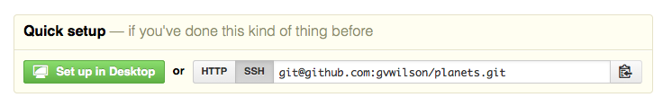
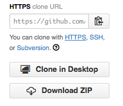

#### Objectives
*   Explain what remote repositories are and why they are useful.
*   Explain what happens when a remote repository is cloned.
*   Explain what happens when changes are pushed to or pulled from a remote repository.

Version control really comes into its own
when we begin to collaborate with other people.
We already have most of the machinery we need to do this;
the only thing missing is to copy changes from one repository to another.

Systems like Git and Mercurial allow us to move work between any two repositories.
In practice,
though,
it's easiest to use one copy as a central hub,
and to keep it on the web rather than on someone's laptop.
Most programmers use hosting services like [GitHub](http://github.com) or [BitBucket](http://bitbucket.org)
to hold those master copies;
we'll explore the pros and cons of this in the final section of this lesson.

Let's start by sharing the changes we've made to our current project with the world.
Log in to GitHub,
then click on the icon in the top right corner to create a new repository called `planets`:

Name your repository "planets" and then click "Create Repository":

As soon as the repository is created,
GitHub displays a page with a URL and some information on how to configure your local repository:

This effectively does the following on GitHub's servers:

~~~
$ mkdir planets
$ cd planets
$ git init
~~~

Our local repository still contains our earlier work on `mars.txt`,
but the remote repository on GitHub doesn't contain any files yet:

The next step is to connect the two repositories.
We do this by making the GitHub repository a [remote](../gloss.html#repository-remote)
for the local repository.
The home page of the repository on GitHub includes
the string we need to identify it:

Click on the 'HTTPS' link to change the [protocol](../../gloss.html#protocol) from SSH to HTTPS.
It's slightly less convenient for day-to-day use,
but much less work for beginners to set up:

Copy that URL from the browser,
go into the local `planets` repository,
and run this command:

~~~
$ git remote add origin https://github.com/vlad/planets
~~~

Make sure to use the URL for your repository rather than Vlad's:
the only difference should be your username instead of `vlad`.

We can check that the command has worked by running `git remote -v`:

~~~
$ git remote -v
origin   https://github.com/vlad/planets.git (push)
origin   https://github.com/vlad/planets.git (fetch)
~~~

The name `origin` is a local nickname for your remote repository:
we could use something else if we wanted to,
but `origin` is by far the most common choice.

Once the nickname `origin` is set up,
this command will push the changes from our local repository
to the repository on GitHub:

~~~
$ git push origin master
Counting objects: 9, done.
Delta compression using up to 4 threads.
Compressing objects: 100% (6/6), done.
Writing objects: 100% (9/9), 821 bytes, done.
Total 9 (delta 2), reused 0 (delta 0)
To https://github.com/vlad/planets
 * [new branch]      master -> master
Branch master set up to track remote branch master from origin.
~~~

Our local and remote repositories are now in this state:

> #### The '-u' Flag
>
> You may see a `-u` option used with `git push` in some documentation.
> It is related to concepts we cover in our intermediate lesson,
> and can safely be ignored for now.

We can pull changes from the remote repository to the local one as well:

~~~
$ git pull origin master
From https://github.com/vlad/planets
 * branch            master     -> FETCH_HEAD
Already up-to-date.
~~~

Pulling has no effect in this case
because the two repositories are already synchronized.
If someone else had pushed some changes to the repository on GitHub,
though,
this command would download them to our local repository.

We can simulate working with a collaborator using another copy of the repository on our local machine.
To do this,
`cd` to the directory `/tmp`.
(Note the absolute path:
don't make `tmp` a subdirectory of the existing repository).
Instead of creating a new repository here with `git init`,
we will [clone](../gloss.html#repository-clone) the existing repository from GitHub:

~~~
$ cd /tmp
$ git clone https://github.com/vlad/planets.git
~~~

`git clone` creates a fresh local copy of a remote repository.
(We did it in `/tmp` or some other directory so that we don't overwrite our existing `planets` directory.)
Our computer now has two copies of the repository:

Let's make a change in the copy in `/tmp/planets`:

~~~
$ cd /tmp/planets
$ nano pluto.txt
$ cat pluto.txt
It is so a planet!
$ git add pluto.txt
$ git commit -m "Some notes about Pluto"
 1 file changed, 1 insertion(+)
 create mode 100644 pluto.txt
~~~

then push the change to GitHub:

~~~
$ git push origin master
Counting objects: 4, done.
Delta compression using up to 4 threads.
Compressing objects: 100% (2/2), done.
Writing objects: 100% (3/3), 306 bytes, done.
Total 3 (delta 0), reused 0 (delta 0)
To https://github.com/vlad/planets.git
   9272da5..29aba7c  master -> master
~~~

Note that we didn't have to create a remote called `origin`:
Git does this automatically,
using that name,
when we clone a repository.
(This is why `origin` was a sensible choice earlier
when we were setting up remotes by hand.)

Our three repositories now look like this:

We can now download changes into the original repository on our machine:

~~~
$ cd ~/planets
$ git pull origin master
remote: Counting objects: 4, done.
remote: Compressing objects: 100% (2/2), done.
remote: Total 3 (delta 0), reused 3 (delta 0)
Unpacking objects: 100% (3/3), done.
From https://github.com/vlad/planets
 * branch            master     -> FETCH_HEAD
Updating 9272da5..29aba7c
Fast-forward
 pluto.txt | 1 +
 1 file changed, 1 insertion(+)
 create mode 100644 pluto.txt
~~~

which gives us this:

In practice,
we would probably never have two copies of the same remote repository
on our laptop at once.
Instead,
one of those copies would be on our laptop,
and the other on a lab machine,
or on someone else's computer.
Pushing and pulling changes gives us a reliable way
to share work between different people and machines.

#### Key Points
*   A local Git repository can be connected to one or more remote repositories.
*   Use the HTTPS protocol to connect to remote repositories until you have learned how to set up SSH.
*   `git push` copies changes from a local repository to a remote repository.
*   `git pull` copies changes from a remote repository to a local repository.
*   `git clone` copies a remote repository to create a local repository with a remote called `origin` automatically set up.

#### Challenges

1.  Create a repository on GitHub,
    clone it,
    add a file,
    push those changes to GitHub,
    and then look at the [timestamp](../../gloss.html#timestamp) of the change on GitHub.
    How does GitHub record times, and why?

