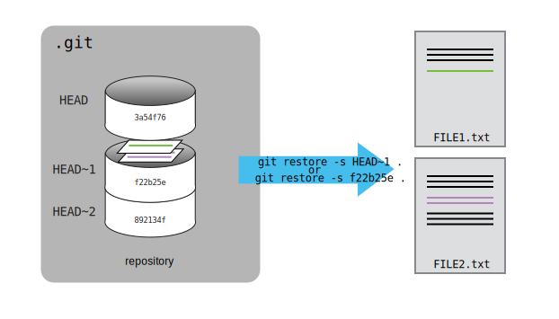

::::::::::::::::::::::::::::::::::::::: objectives

- Explain what the HEAD of a repository is and how to use it.
- Identify and use Git commit numbers.
- Compare various versions of tracked files.
- Restore old versions of files.

::::::::::::::::::::::::::::::::::::::::::::::::::

:::::::::::::::::::::::::::::::::::::::: questions

- How can I identify old versions of files?
- How do I review my changes?
- How can I recover old versions of files?

::::::::::::::::::::::::::::::::::::::::::::::::::

As we saw in the previous episode, we can refer to commits by their
identifiers.  You can refer to the *most recent commit* of the working
directory by using the identifier `HEAD`.

We've been adding small changes at a time to `guacamole.md`, so it's easy to track our
progress by looking, so let's do that using our `HEAD`s.  Before we start,
let's make a change to `guacamole.md`, adding yet another line.

```bash
$ nano guacamole.md
$ cat guacamole.md
```

```output
# Guacamole
## Ingredients
* avocado
* lime
* salt
## Instructions
An ill-considered change
```

Now, let's see what we get.

```bash
$ git diff HEAD guacamole.md
```

```output
diff --git a/guacamole.md b/guacamole.md
index b36abfd..0848c8d 100644
--- a/guacamole.md
+++ b/guacamole.md
@@ -4,3 +4,4 @@
 * lime
 * salt
 ## Instructions
+An ill-considered change
```

which is the same as what you would get if you leave out `HEAD` (try it).  The
real goodness in all this is when you can refer to previous commits.  We do
that by adding `~1`
(where "~" is "tilde", pronounced [**til**\-d*uh*])
to refer to the commit one before `HEAD`.

```bash
$ git diff HEAD~1 guacamole.md
```

If we want to see the differences between older commits we can use `git diff`
again, but with the notation `HEAD~1`, `HEAD~2`, and so on, to refer to them:

```bash
$ git diff HEAD~2 guacamole.md
```

```output
diff --git a/guacamole.md b/guacamole.md
index df0654a..b36abfd 100644
--- a/guacamole.md
+++ b/guacamole.md
@@ -1,3 +1,6 @@
 # Guacamole
 ## Ingredients
+* avocado
+* lime
+* salt
 ## Instructions
```

We could also use `git show` which shows us what changes we made at an older commit as
well as the commit message, rather than the *differences* between a commit and our
working directory that we see by using `git diff`.

```bash
$ git show HEAD~2 guacamole.md
```

```output
commit f22b25e3233b4645dabd0d81e651fe074bd8e73b
Author: Alfredo Linguini <a.linguini@ratatouille.fr>
Date:   Thu Aug 22 10:07:21 2013 -0400

    Create a template for recipe

diff --git a/guacamole.md b/guacamole.md
new file mode 100644
index 0000000..df0654a
--- /dev/null
+++ b/guacamole.md
@@ -0,0 +1,3 @@
+# Guacamole
+## Ingredients
+## Instructions
```

In this way,
we can build up a chain of commits.
The most recent end of the chain is referred to as `HEAD`;
we can refer to previous commits using the `~` notation,
so `HEAD~1`
means "the previous commit",
while `HEAD~123` goes back 123 commits from where we are now.

We can also refer to commits using
those long strings of digits and letters
that both `git log` and `git show` display.
These are unique IDs for the changes,
and "unique" really does mean unique:
every change to any set of files on any computer
has a unique 40-character identifier.
Our first commit was given the ID
`f22b25e3233b4645dabd0d81e651fe074bd8e73b`,
so let's try this:

```bash
$ git diff f22b25e3233b4645dabd0d81e651fe074bd8e73b guacamole.md
```

```output
diff --git a/guacamole.md b/guacamole.md
index df0654a..93a3e13 100644
--- a/guacamole.md
+++ b/guacamole.md
@@ -1,3 +1,7 @@
 # Guacamole
 ## Ingredients
+* avocado
+* lime
+* salt
 ## Instructions
+An ill-considered change
```

That's the right answer,
but typing out random 40-character strings is annoying,
so Git lets us use just the first few characters (typically seven for normal size projects):

```bash
$ git diff f22b25e guacamole.md
```

```output
diff --git a/guacamole.md b/guacamole.md
index df0654a..93a3e13 100644
--- a/guacamole.md
+++ b/guacamole.md
@@ -1,3 +1,7 @@
 # Guacamole
 ## Ingredients
+* avocado
+* lime
+* salt
 ## Instructions
+An ill-considered change
```

All right! So
we can save changes to files and see what we've changed. Now, how
can we restore older versions of things?
Let's suppose we change our mind about the last update to
`guacamole.md` (the "ill-considered change").

`git status` now tells us that the file has been changed,
but those changes haven't been staged:

```bash
$ git status
```

```output
On branch main
Changes not staged for commit:
  (use "git add <file>..." to update what will be committed)
  (use "git restore <file>..." to discard changes in working directory)
    modified:   guacamole.md

no changes added to commit (use "git add" and/or "git commit -a")
```

We can put things back the way they were
by using `git restore`:

```bash
$ git restore guacamole.md
$ cat guacamole.md
```

```output
# Guacamole
## Ingredients
* avocado
* lime
* salt
## Instructions
```

As you might guess from its name,
`git restore` restores an old version of a file.
By default,
it recovers the version of the file recorded in `HEAD`,
which is the last saved commit.
If we want to go back even further,
we can use a commit identifier instead, using `-s` option:

```bash
$ git restore -s f22b25e guacamole.md
```

```bash
$ cat guacamole.md
```

```output
# Guacamole
## Ingredients
## Instructions
```

```bash
$ git status
```

```output
On branch main
Changes not staged for commit:
  (use "git add <file>..." to update what will be committed)
  (use "git restore <file>..." to discard changes in working directory)
    modified:   guacamole.md

no changes added to commit (use "git add" and/or "git commit -a")

```

Notice that the changes are not currently in the staging area, and have not been committed. 
If we wished, we can put things back the way they were at the last commit by using `git restore` to overwrite
the working copy with the last committed version:

```bash
$ git restore guacamole.md
$ cat guacamole.md
```

```output
# Guacamole
## Ingredients
* avocado
* lime
* salt
## Instructions
```

It's important to remember that
we must use the commit number that identifies the state of the repository
*before* the change we're trying to undo.
A common mistake is to use the number of
the commit in which we made the change we're trying to discard.
In the example below, we want to retrieve the state from before the most
recent commit (`HEAD~1`), which is commit `f22b25e`. We use the `.` to mean all files:

{alt='A diagram showing how git restore can be used to restore the previous version of two files'}

So, to put it all together,
here's how Git works in cartoon form:

{alt='A diagram showing the entire git workflow: local changes are staged using git add, applied to the local repository using git commit, and can be restored from the repository using git checkout'}


The fact that files can be reverted one by one
tends to change the way people organize their work.
If everything is in one large document,
it's hard (but not impossible) to undo changes to the introduction
without also undoing changes made later to the conclusion.
If the introduction and conclusion are stored in separate files,
on the other hand,
moving backward and forward in time becomes much easier.

:::::::::::::::::::::::::::::::::::::::  challenge

## Recovering Older Versions of a File

Jennifer has made changes to the Python script that she has been working on for weeks, and the
modifications she made this morning "broke" the script and it no longer runs. She has spent
\~ 1hr trying to fix it, with no luck...

Luckily, she has been keeping track of her project's versions using Git! Which commands below will
let her recover the last committed version of her Python script called
`data_cruncher.py`?

1. `$ git restore`

2. `$ git restore data_cruncher.py`

3. `$ git restore -s HEAD~1 data_cruncher.py`

4. `$ git restore -s <unique ID of last commit> data_cruncher.py`

5. Both 2 and 4

:::::::::::::::  solution

## Solution

The answer is (5)-Both 2 and 4.

The `restore` command restores files from the repository, overwriting the files in your working
directory. Answers 2 and 4 both restore the *latest* version *in the repository* of the file
`data_cruncher.py`. Answer 2 uses `HEAD` to indicate the *latest*, whereas answer 4 uses the
unique ID of the last commit, which is what `HEAD` means.

Answer 3 gets the version of `data_cruncher.py` from the commit *before* `HEAD`, which is NOT
what we wanted.

Answer 1 results in an error. You need to specify a file to restore. If you want to restore all files
you should use `git restore .`


:::::::::::::::::::::::::

::::::::::::::::::::::::::::::::::::::::::::::::::

:::::::::::::::::::::::::::::::::::::::  challenge

## Reverting a Commit

Jennifer is collaborating with colleagues on her Python script.  She
realizes her last commit to the project's repository contained an error, and
wants to undo it.  Jennifer wants to undo correctly so everyone in the project's
repository gets the correct change. The command `git revert [erroneous commit ID]` will create a
new commit that reverses the erroneous commit.

The command `git revert` is
different from `git restore -s [commit ID] .` because `git restore` returns the
files not yet committed within the local repository to a previous state, whereas `git revert`
reverses changes committed to the local and project repositories.

Below are the right steps and explanations for Jennifer to use `git revert`,
what is the missing command?

1. `________ # Look at the git history of the project to find the commit ID`

2. Copy the ID (the first few characters of the ID, e.g. 0b1d055).

3. `git revert [commit ID]`

4. Type in the new commit message.

5. Save and close.

:::::::::::::::  solution

## Solution

The command `git log` lists project history with commit IDs.

The command `git show HEAD` shows changes made at the latest commit, and lists
the commit ID; however, Jennifer should double-check it is the correct commit, and no one
else has committed changes to the repository.


:::::::::::::::::::::::::

::::::::::::::::::::::::::::::::::::::::::::::::::

:::::::::::::::::::::::::::::::::::::::  challenge

## Understanding Workflow and History

What is the output of the last command in

```bash
$ cd recipes
$ echo "I like tomatoes, therefore I like ketchup" > ketchup.md
$ git add ketchup.md
$ echo "ketchup enhances pasta dishes" >> ketchup.md
$ git commit -m "My opinions about the red sauce"
$ git restore ketchup.md
$ cat ketchup.md # this will print the content of ketchup.md on screen
```

1. ```output
   ketchup enhances pasta dishes
   ```
2. ```output
   I like tomatoes, therefore I like ketchup
   ```
3. ```output
   I like tomatoes, therefore I like ketchup
   ketchup enhances pasta dishes
   ```
4. ```output
   Error because you have changed ketchup.md without committing the changes
   ```

:::::::::::::::  solution

## Solution

The answer is 2.

The changes to the file from the second `echo` command are only applied to the working copy,
The command `git add ketchup.md` places the current version of `ketchup.md` into the staging area.
not the version in the staging area.

So, when `git commit -m "My opinions about the red sauce"` is executed,
the version of `ketchup.md` committed to the repository is the one from the staging area and
has only one line.

At this time, the working copy still has the second line (and

`git status` will show that the file is modified). However, `git restore ketchup.md`
replaces the working copy with the most recently committed version of `ketchup.md`.
So, `cat ketchup.md` will output

```output
I like tomatoes, therefore I like ketchup
```

:::::::::::::::::::::::::

::::::::::::::::::::::::::::::::::::::::::::::::::

:::::::::::::::::::::::::::::::::::::::  challenge

## Checking Understanding of `git diff`

Consider this command: `git diff HEAD~9 guacamole.md`. What do you predict this command
will do if you execute it? What happens when you do execute it? Why?

Try another command, `git diff [ID] guacamole.md`, where [ID] is replaced with
the unique identifier for your most recent commit. What do you think will happen,
and what does happen?


::::::::::::::::::::::::::::::::::::::::::::::::::

:::::::::::::::::::::::::::::::::::::::  challenge

## Getting Rid of Staged Changes

`git restore` can be used to restore a previous commit when unstaged changes have
been made, but will it also work for changes that have been staged but not committed?
Make a change to `guacamole.md`, add that change using `git add`,
then use `git restore` to see if you can remove your change.

:::::::::::::::  solution

## Solution

After adding a change, `git restore` can not be used directly.
Let's look at the output of `git status`:

```output
On branch main
Changes to be committed:
  (use "git restore --staged <file>..." to unstage)
        modified:   guacamole.md

```

Note that if you don't have the same output
you may either have forgotten to change the file,
or you have added it *and* committed it.

Using the command `git restore guacamole.md` now does not give an error,
but it does not restore the file either.
Git helpfully tells us that we need to use `git restore --staged` first
to unstage the file:

```bash
$ git restore --staged guacamole.md
```


Now, `git status` gives us:

```bash
$ git status
```

```output
On branch main
Changes not staged for commit:
  (use "git add <file>..." to update what will be committed)
  (use "git git restore <file>..." to discard changes in working directory)
        modified:   guacamole.md

no changes added to commit (use "git add" and/or "git commit -a")
```

This means we can now use `git restore` to restore the file
to the previous commit:

```bash
$ git restore guacamole.md
$ git status
```

```output
On branch main
nothing to commit, working tree clean
```

:::::::::::::::::::::::::

::::::::::::::::::::::::::::::::::::::::::::::::::

:::::::::::::::::::::::::::::::::::::::  challenge

## Explore and Summarize Histories

Exploring history is an important part of Git, and often it is a challenge to find
the right commit ID, especially if the commit is from several months ago.

Imagine the `recipes` project has more than 50 files.
You would like to find a commit that modifies some specific text in `guacamole.md`.
When you type `git log`, a very long list appeared.
How can you narrow down the search?

Recall that the `git diff` command allows us to explore one specific file,
e.g., `git diff guacamole.md`. We can apply a similar idea here.

```bash
$ git log guacamole.md
```

Unfortunately some of these commit messages are very ambiguous, e.g., `update files`.
How can you search through these files?

Both `git diff` and `git log` are very useful and they summarize a different part of the history
for you.
Is it possible to combine both? Let's try the following:

```bash
$ git log --patch guacamole.md
```

You should get a long list of output, and you should be able to see both commit messages and
the difference between each commit.

Question: What does the following command do?

```bash
$ git log --patch HEAD~9 *.md
```

::::::::::::::::::::::::::::::::::::::::::::::::::

:::::::::::::::::::::::::::::::::::::::: keypoints

- `git diff` displays differences between commits.
- `git restore` recovers old versions of files.

::::::::::::::::::::::::::::::::::::::::::::::::::
