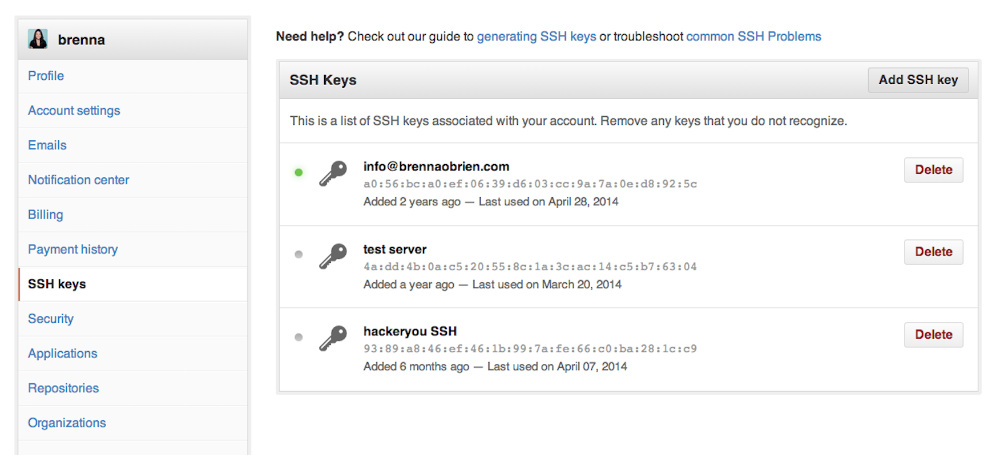
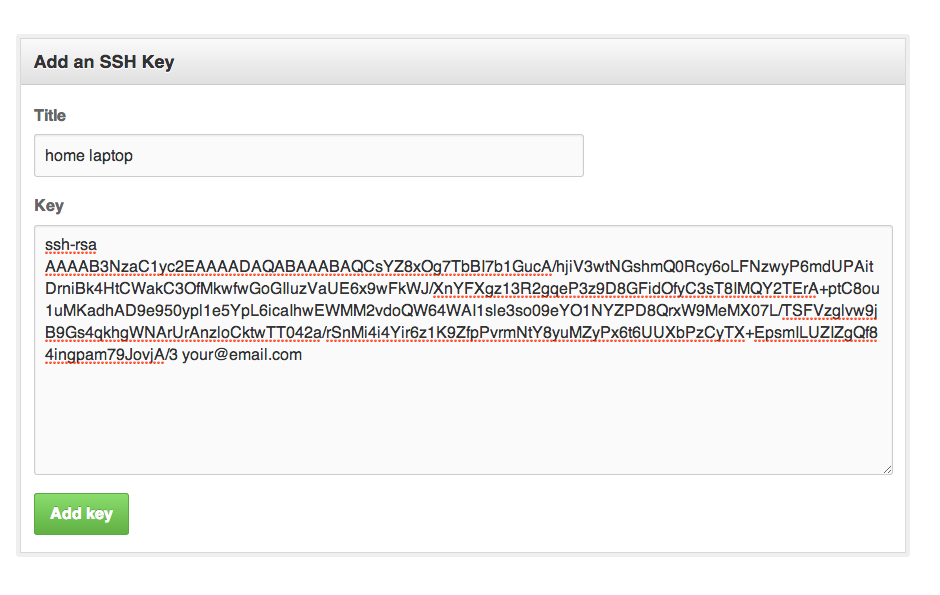
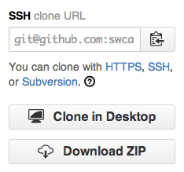

#### Objectives
*   Explain what an SSH key is
*   Generate your own SSH key pair
*   Add your SSH key to your GitHub account
*   Learn how to use your SSH key in your GitHub workflow

#### Why Use an SSH Key?

When working with a GitHub repository, you'll often need to identify yourself to GitHub using your username and password. An SSH key is an alternate way to identify yourself that doesn't require you to enter you username and password every time.

SSH keys come in pairs, a public key that gets shared with services like GitHub, and a private key that is stored only on your computer. If the keys match, you're granted access.  

The cryptography behind SSH keys ensures that no one can reverse engineer your private key from the public one.

#### Generating an SSH key pair

The first step in using SSH authorization with GitHub is to generate your own key pair.

You might already have an SSH key pair on your machine. You can check to see if one exists by moving to your `.ssh` directory and listing the contents.

~~~
$ cd ~/.ssh
$ ls
~~~

If you see `id_rsa.pub`, you already have a key pair and don't need to create a new one.

If you don't see `id_rsa.pub`, use the following command to generate a new key pair. Make sure to replace `your@email.com` with your own email address.

~~~
$ ssh-keygen -t rsa -C "your@email.com"
~~~

When asked where to save the new key, hit enter to accept the default location.

~~~
Generating public/private rsa key pair.
Enter file in which to save the key (/Users/username/.ssh/id_rsa):
~~~

You will then be asked to provide a passphrase. Type a new password and hit enter.

~~~
Enter passphrase (empty for no passphrase):
~~~

Next, confirm your passphrase by typing it again and hitting enter.

~~~
Enter same passphrase again:
~~~

When the key generation is complete, you should see the following confirmation:

~~~
Your identification has been saved in /Users/username/.ssh/id_rsa.
Your public key has been saved in /Users/username/.ssh/id_rsa.pub.
The key fingerprint is:
01:0f:f4:3b:ca:85:d6:17:a1:7d:f0:68:9d:f0:a2:db your@email.com
The key's randomart image is:
+--[ RSA 2048]----+
|                 |
|                 |
|        . E +    |
|       . o = .   |
|      . S =   o  |
|       o.O . o   |
|       o .+ .    |
|      . o+..     |
|       .+=o      |
+-----------------+
~~~

#### Add your public key to GitHub

We now need to tell GitHub about your public key. Copy it to your clipboard using the following command:

~~~
$ pbcopy < ~/.ssh/id_rsa.pub
~~~

It's okay if you don't see any output.

Login to github.com and bring up your account settings by clicking the tools icon.

Select **SSH Keys** from the side menu, then click the **Add SSH key** button.

Name your key something whatever you like, and paste the contents of your clipboard into the **Key** text box. It should look something like this.

Finally, hit **Add key** to save. Enter your github password if prompted.

####Using Your SSH Key

Going forward, you can use the SSH clone URL when copying a repo to your local machine.

This will allow you to bypass entering your username and password for future GitHub commands. You *will* have to enter your SSH key passphrase the first time your use the key, but this only needs to be done once.

If you're using OS X, your passphrase can be saved by checking off the **remember password** option.

If you're on Windows, you can follow [these instructions](https://help.github.com/articles/working-with-ssh-key-passphrases#platform-windows) to have your passphrase saved after the first use.

#### Key Points
*  SSH is a secure alternative to username/password authorization
*  SSH keys are generated in public / private pairs. Your public key can be shared with others. The private keys stays on your machine only.
*  You can authorize with GitHub through SSH by sharing your public key with GitHub.

