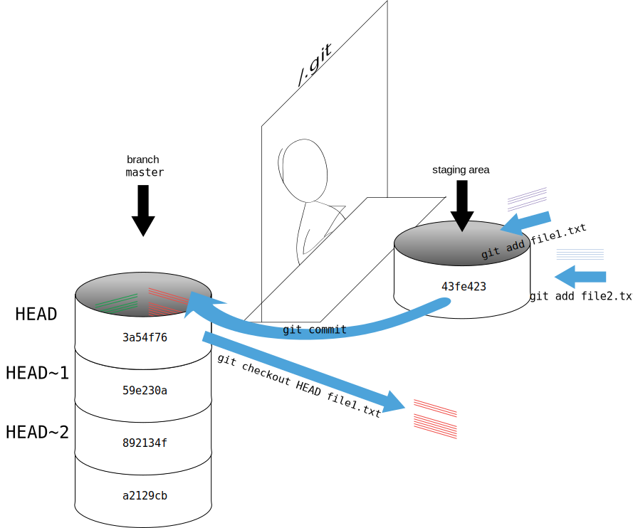

As we saw in the previous lesson, we can refer to commits by their
identifiers.  You can refer to the _most recent commit_ of the working
directory by using the identifier `HEAD`.

We've been adding one line at a time to `mars.txt`, so it's easy to track our
progress by looking, so let's do that using our `HEAD`s.  Before we start,
let's make a change to `mars.txt`.

~~~
$ nano mars.txt
$ cat mars.txt
~~~
{: .language-bash}

~~~
Cold and dry, but everything is my favorite color
The two moons may be a problem for Wolfman
But the Mummy will appreciate the lack of humidity
An ill-considered change
~~~
{: .output}

Now, let's see what we get.

~~~
$ git diff HEAD mars.txt
~~~
{: .language-bash}

~~~
diff --git a/mars.txt b/mars.txt
index b36abfd..0848c8d 100644
--- a/mars.txt
+++ b/mars.txt
@@ -1,3 +1,4 @@
 Cold and dry, but everything is my favorite color
 The two moons may be a problem for Wolfman
 But the Mummy will appreciate the lack of humidity
+An ill-considered change.
~~~
{: .output}

which is the same as what you would get if you leave out `HEAD` (try it).  The
real goodness in all this is when you can refer to previous commits.  We do
that by adding `~1` 
(where "~" is "tilde", pronounced [**til**-d*uh*]) 
to refer to the commit one before `HEAD`.

~~~
$ git diff HEAD~1 mars.txt
~~~
{: .language-bash}

If we want to see the differences between older commits we can use `git diff`
again, but with the notation `HEAD~1`, `HEAD~2`, and so on, to refer to them:

~~~
$ git diff HEAD~2 mars.txt
~~~
{: .language-bash}

~~~
diff --git a/mars.txt b/mars.txt
index df0654a..b36abfd 100644
--- a/mars.txt
+++ b/mars.txt
@@ -1 +1,4 @@
 Cold and dry, but everything is my favorite color
+The two moons may be a problem for Wolfman
+But the Mummy will appreciate the lack of humidity
+An ill-considered change
~~~
{: .output}

We could also use `git show` which shows us what changes we made at an older commit as well as the commit message, rather than the _differences_ between a commit and our working directory that we see by using `git diff`.

~~~
$ git show HEAD~2 mars.txt
~~~
{: .language-bash}

~~~
commit 34961b159c27df3b475cfe4415d94a6d1fcd064d
Author: Vlad Dracula <vlad@tran.sylvan.ia>
Date:   Thu Aug 22 10:07:21 2013 -0400

    Start notes on Mars as a base

diff --git a/mars.txt b/mars.txt
new file mode 100644
index 0000000..df0654a
--- /dev/null
+++ b/mars.txt
@@ -0,0 +1 @@
+Cold and dry, but everything is my favorite color
~~~
{: .output}

In this way,
we can build up a chain of commits.
The most recent end of the chain is referred to as `HEAD`;
we can refer to previous commits using the `~` notation,
so `HEAD~1`
means "the previous commit",
while `HEAD~123` goes back 123 commits from where we are now.

We can also refer to commits using
those long strings of digits and letters
that `git log` displays.
These are unique IDs for the changes,
and "unique" really does mean unique:
every change to any set of files on any computer
has a unique 40-character identifier.
Our first commit was given the ID
`f22b25e3233b4645dabd0d81e651fe074bd8e73b`,
so let's try this:

~~~
$ git diff f22b25e3233b4645dabd0d81e651fe074bd8e73b mars.txt
~~~
{: .language-bash}

~~~
diff --git a/mars.txt b/mars.txt
index df0654a..93a3e13 100644
--- a/mars.txt
+++ b/mars.txt
@@ -1 +1,4 @@
 Cold and dry, but everything is my favorite color
+The two moons may be a problem for Wolfman
+But the Mummy will appreciate the lack of humidity
+An ill-considered change
~~~
{: .output}

That's the right answer,
but typing out random 40-character strings is annoying,
so Git lets us use just the first few characters:

~~~
$ git diff f22b25e mars.txt
~~~
{: .language-bash}

~~~
diff --git a/mars.txt b/mars.txt
index df0654a..93a3e13 100644
--- a/mars.txt
+++ b/mars.txt
@@ -1 +1,4 @@
 Cold and dry, but everything is my favorite color
+The two moons may be a problem for Wolfman
+But the Mummy will appreciate the lack of humidity
+An ill-considered change
~~~
{: .output}

All right! So
we can save changes to files and see what we've changed—now how
can we restore older versions of things?
Let's suppose we accidentally overwrite our file:

~~~
$ nano mars.txt
$ cat mars.txt
~~~
{: .language-bash}

~~~
We will need to manufacture our own oxygen
~~~
{: .output}

`git status` now tells us that the file has been changed,
but those changes haven't been staged:

~~~
$ git status
~~~
{: .language-bash}

~~~
On branch master
Changes not staged for commit:
  (use "git add <file>..." to update what will be committed)
  (use "git checkout -- <file>..." to discard changes in working directory)

	modified:   mars.txt

no changes added to commit (use "git add" and/or "git commit -a")
~~~
{: .output}

We can put things back the way they were
by using `git checkout`:

~~~
$ git checkout HEAD mars.txt
$ cat mars.txt
~~~
{: .language-bash}

~~~
Cold and dry, but everything is my favorite color
The two moons may be a problem for Wolfman
But the Mummy will appreciate the lack of humidity
~~~
{: .output}

As you might guess from its name,
`git checkout` checks out (i.e., restores) an old version of a file.
In this case,
we're telling Git that we want to recover the version of the file recorded in `HEAD`,
which is the last saved commit.
If we want to go back even further,
we can use a commit identifier instead:

~~~
$ git checkout f22b25e mars.txt
~~~
{: .language-bash}

~~~
$ cat mars.txt
~~~
{: .language-bash}

~~~
Cold and dry, but everything is my favorite color
~~~
{: .output}

~~~
$ git status
~~~
{: .language-bash}

~~~
# On branch master
Changes to be committed:
  (use "git reset HEAD <file>..." to unstage)
# Changes not staged for commit:
#   (use "git add <file>..." to update what will be committed)
#   (use "git checkout -- <file>..." to discard changes in working directory)
#
#	modified:   mars.txt
#
no changes added to commit (use "git add" and/or "git commit -a")
~~~
{: .output}

Notice that the changes are on the staged area.
Again, we can put things back the way they were
by using `git checkout`:

~~~
$ git checkout HEAD mars.txt
~~~
{: .language-bash}

> ## Don't Lose Your HEAD
>
> Above we used
>
> ~~~
> $ git checkout f22b25e mars.txt
> ~~~
> {: .language-bash}
>
> to revert `mars.txt` to its state after the commit `f22b25e`. But be careful! 
> The command `checkout` has other important functionalities and Git will misunderstand
> your intentions if you are not accurate with the typing. For example, 
> if you forget `mars.txt` in the previous command.
>
> ~~~
> $ git checkout f22b25e
> ~~~
> {: .language-bash}
> ~~~
> Note: checking out 'f22b25e'.
>
> You are in 'detached HEAD' state. You can look around, make experimental
> changes and commit them, and you can discard any commits you make in this
> state without impacting any branches by performing another checkout.
>
> If you want to create a new branch to retain commits you create, you may
> do so (now or later) by using -b with the checkout command again. Example:
>
>  git checkout -b <new-branch-name>
>
> HEAD is now at f22b25e Start notes on Mars as a base
> ~~~
> {: .error}
>
> The "detached HEAD" is like "look, but don't touch" here,
> so you shouldn't make any changes in this state.
> After investigating your repo's past state, reattach your `HEAD` with `git checkout master`.
{: .callout}

It's important to remember that
we must use the commit number that identifies the state of the repository
*before* the change we're trying to undo.
A common mistake is to use the number of
the commit in which we made the change we're trying to get rid of.
In the example below, we want to retrieve the state from before the most
recent commit (`HEAD~1`), which is commit `f22b25e`:

So, to put it all together,
here's how Git works in cartoon form:

> ## Simplifying the Common Case
>
> If you read the output of `git status` carefully,
> you'll see that it includes this hint:
>
> ~~~
> (use "git checkout -- <file>..." to discard changes in working directory)
> ~~~
> {: .language-bash}
>
> As it says,
> `git checkout` without a version identifier restores files to the state saved in `HEAD`.
> The double dash `--` is needed to separate the names of the files being recovered
> from the command itself:
> without it,
> Git would try to use the name of the file as the commit identifier.
{: .callout}

The fact that files can be reverted one by one
tends to change the way people organize their work.
If everything is in one large document,
it's hard (but not impossible) to undo changes to the introduction
without also undoing changes made later to the conclusion.
If the introduction and conclusion are stored in separate files,
on the other hand,
moving backward and forward in time becomes much easier.

> ## Recovering Older Versions of a File
>
> Jennifer has made changes to the Python script that she has been working on for weeks, and the
> modifications she made this morning "broke" the script and it no longer runs. She has spent
> ~ 1hr trying to fix it, with no luck...
>
> Luckily, she has been keeping track of her project's versions using Git! Which commands below will
> let her recover the last committed version of her Python script called
> `data_cruncher.py`?
>
> 1. `$ git checkout HEAD`
>
> 2. `$ git checkout HEAD data_cruncher.py`
>
> 3. `$ git checkout HEAD~1 data_cruncher.py`
>
> 4. `$ git checkout <unique ID of last commit> data_cruncher.py`
>
> 5. Both 2 and 4
{: .challenge}

> ## Reverting a Commit
>
> Jennifer is collaborating on her Python script with her colleagues and
> realizes her last commit to the group repository is wrong and wants to
> undo it.  Jennifer needs to undo correctly so everyone in the group
> repository gets the correct change.  `git revert [wrong commit ID]`
> will make a new commit that undoes Jennifer's previous wrong
> commit. Therefore `git revert` is different than `git checkout [commit
> ID]` because `checkout` is for local changes not committed to the
> group repository.  Below are the right steps and explanations for
> Jennifer to use `git revert`, what is the missing command?
>
> 1. `________ # Look at the git history of the project to find the commit ID`
>
> 2. Copy the ID (the first few characters of the ID, e.g. 0b1d055).
>
> 3. `git revert [commit ID]`
>
> 4. Type in the new commit message.
>
> 5. Save and close
{: .challenge}

> ## Understanding Workflow and History
>
> What is the output of the last command in
>
> ~~~
> $ cd planets
> $ echo "Venus is beautiful and full of love" > venus.txt
> $ git add venus.txt
> $ echo "Venus is too hot to be suitable as a base" >> venus.txt
> $ git commit -m "Comment on Venus as an unsuitable base"
> $ git checkout HEAD venus.txt
> $ cat venus.txt #this will print the contents of venus.txt to the screen
> ~~~
> {: .language-bash}
>
> 1. ~~~
>    Venus is too hot to be suitable as a base
>    ~~~
>    {: .output}
> 2. ~~~
>    Venus is beautiful and full of love
>    ~~~
>    {: .output}
> 3. ~~~
>    Venus is beautiful and full of love
>    Venus is too hot to be suitable as a base
>    ~~~
>    {: .output}
> 4. ~~~
>    Error because you have changed venus.txt without committing the changes
>    ~~~
>    {: .output}
>
> > ## Solution
> >
> > The answer is 2 because `git add venus.txt` was used only before add the line
> > `Venus is too hot to be suitable as a base`
> > which was lost when `git checkout` was executed.
> > Using the flag `-a` with `git commit` would have prevented the lost.
> {: .solution}
{: .challenge}

> ## Checking Understanding of `git diff`
>
> Consider this command: `git diff HEAD~3 mars.txt`. What do you predict this command
> will do if you execute it? What happens when you do execute it? Why?
>
> Try another command, `git diff [ID] mars.txt`, where [ID] is replaced with
> the unique identifier for your most recent commit. What do you think will happen,
> and what does happen?
{: .challenge}

> ## Getting Rid of Staged Changes
>
> `git checkout` can be used to restore a previous commit when unstaged changes have
> been made, but will it also work for changes that have been staged but not committed?
> Make a change to `mars.txt`, add that change, and use `git checkout` to see if
> you can remove your change.
{: .challenge}

> ## Explore and Summarize Histories
>
> Exploring history is an important part of Git, often it is a challenge to find
> the right commit ID, especially if the commit is from several months ago.
>
> Imagine the `planets` project has more than 50 files.
> You would like to find a commit with specific text in `mars.txt` is modified.
> When you type `git log`, a very long list appeared,
> How can you narrow down the search?
>
> Recall that the `git diff` command allow us to explore one specific file,
> e.g. `git diff mars.txt`. We can apply a similar idea here.
>
> ~~~
> $ git log mars.txt
> ~~~
> {: .language-bash}
>
> Unfortunately some of these commit messages are very ambiguous e.g. `update files`.
> How can you search through these files?
>
> Both `git diff` and `git log` are very useful and they summarize a different part of the history for you.
> Is it possible to combine both? Let's try the following:
>
> ~~~
> $ git log --patch mars.txt
> ~~~
> {: .language-bash}
>
> You should get a long list of output, and you should be able to see both commit messages and the difference between each commit.
>
> Question: What does the following command do?
>
> ~~~
> $ git log --patch HEAD~3 *.txt
> ~~~
> {: .language-bash}
{: .challenge}
