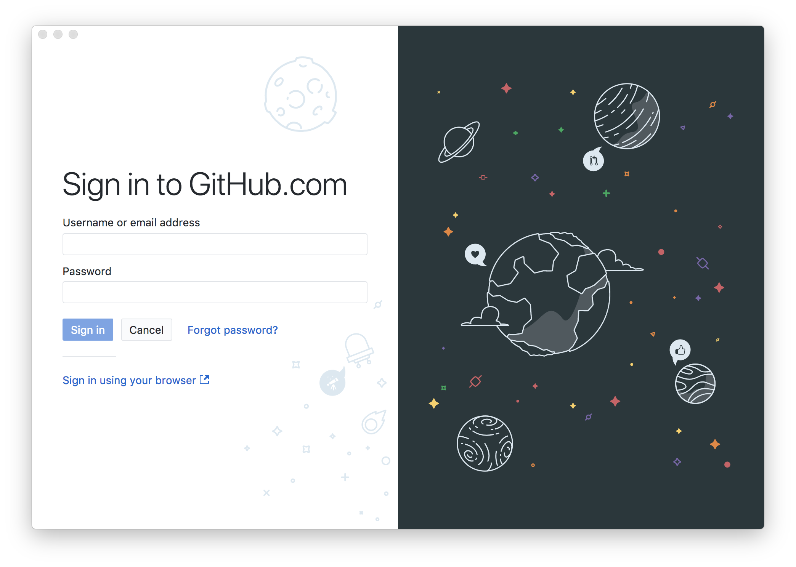
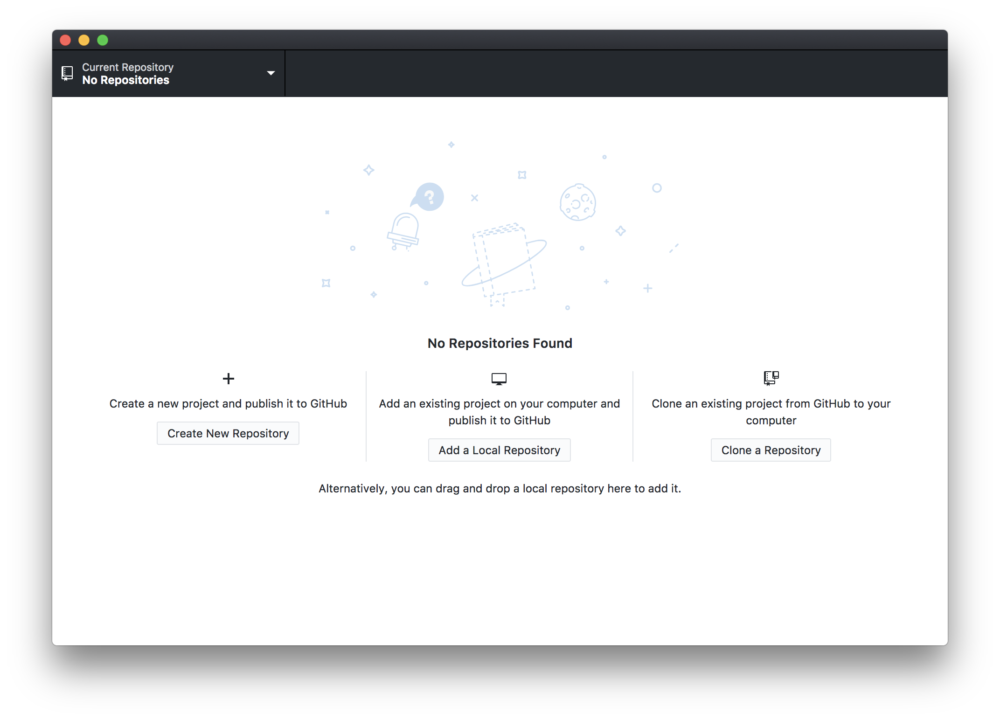
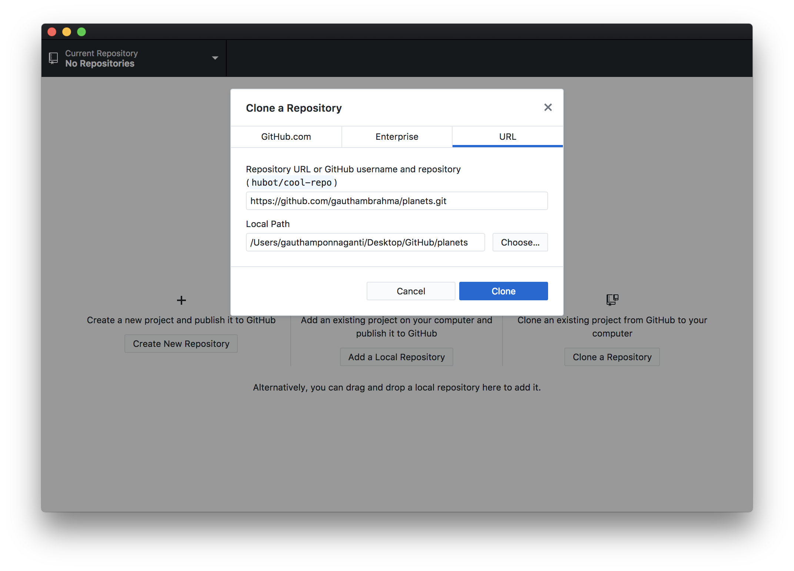
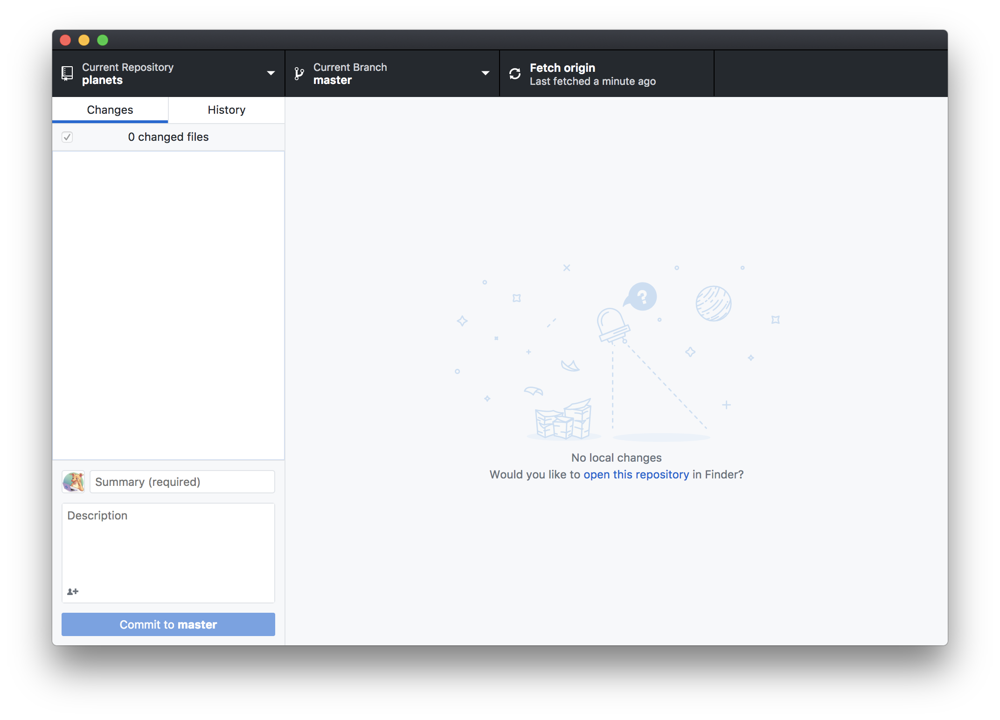
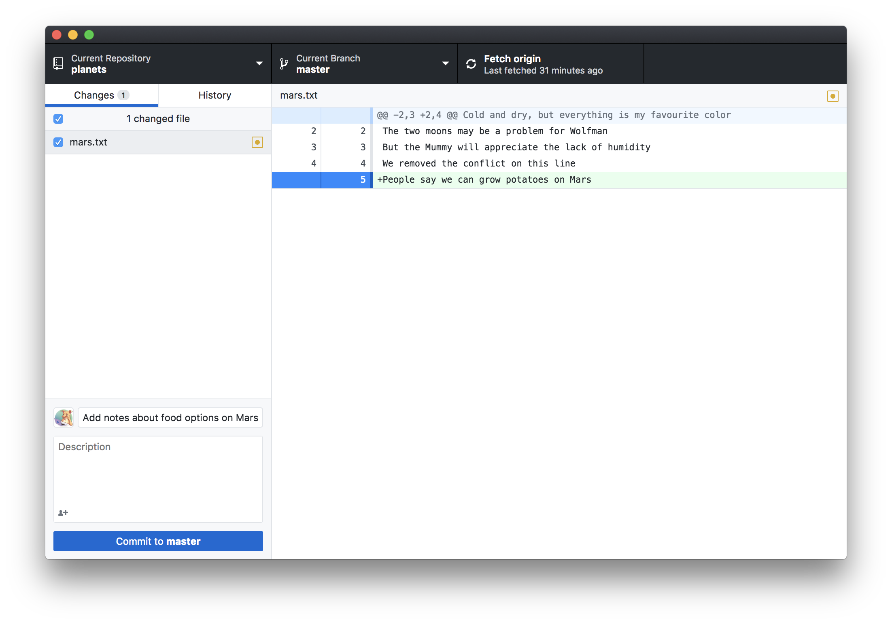
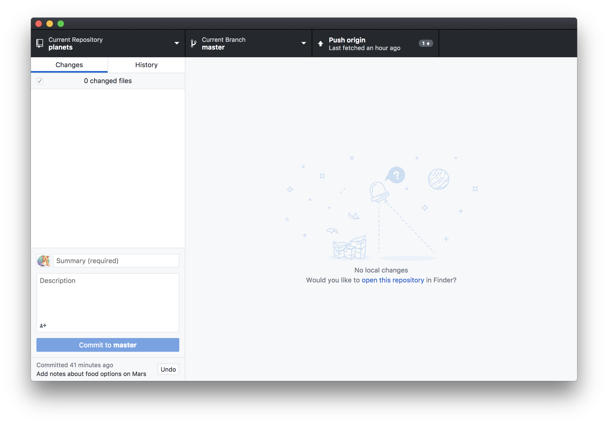

GitHub Desktop is a GUI tool developed by the folks at GitHub. It is an alternative to using Git via the terminal. GitHub desktop can do almost anything a terminal can do which makes it a good option for people who prefer using the GitHub Desktop instead of a terminal. It can also be used in conjunction with the terminal.

> ## Installation
>
>Steps to install GitHub Desktop on your machine:
>
>- Visit the GitHub Desktop official website by clicking on [this link](https://desktop.github.com/).
>
>Windows users only:
>- Download the installer using the "Download for Windows" button
>- In your computer's download folder double-click on the file named GitHub Desktop.
>- click install in the pop-up window. After the program is installed click run.
>
>Mac users only:
>- Download the installer using the "Download for Mac" button
>- In your computer's download folder double-click on the zip file named GitHub Desktop.
>- After the file has been unzipped, double click on the GitHub GitHub Desktop.
>
> The GitHub Desktop is currently in development for Linux environment. You can track the progress 
> [on this GitHub page](https://github.com/desktop/desktop/issues/1525).
{: .callout}

After you follow the steps above you should be able to see the screen shown below. Login with the username and password you used for the GitHub Website. 

Once you log-in successfully you will be see the screen shown below

Let us start by cloning our planets repository into a new folder on our Desktop, similar to what we did [here](http://swcarpentry.github.io/git-novice/07-github/index.html). Only this time we will do it from the GUI instead of the terminal.
Start by clicking on the "Clone a Repository" button on the screen. It will open up a window shown below. 

Select the "URL" option right below the close button.In the first field enter the url of the planets repository and in the second field enter the local path that you want the repository to be cloned to. The options should look similar to what is shown below. 

Its a good practice to clone all your repositories into a "GitHub" folder. This way you know which projects on your computer have Git repositories. 

The screen below is the home screen for your repository. It is where we see all the changes and perform all our actions.

> ## What did we just do here?
>
> We have, using the GUI did the step below
> ~~~
> $ git clone https://github.com/gauthambrahma/planets.git ~/Desktop/GitHub/planets
> ~~~
> {: .language-bash}
{: .callout}

Next, let us try to change our mars.txt and commit it using GitHub Desktop.

Let us add another line to our mars.txt file from the terminal and save it:
~~~
$ cd ~/Desktop/GitHub/planets
$ nano mars.txt
$ cat mars.txt
~~~
{: .language-bash}

~~~
Cold and dry, but everything is my favorite color
The two moons may be a problem for Wolfman
But the Mummy will appreciate the lack of humidity
We removed the conflict on this line
People say we can grow potatoes on Mars
~~~
{: .output}

Now go back to your GitHub Desktop application and you will see the following screen. 

> ## What did we just do here?
>
> A couple of things are happening here -
>
> Changes in the file are automatically highlighted. It is similar to:
> ~~~
> $ git diff mars.txt 
> ~~~
>{: .language-bash}
>
>
> On the left panel there is a checkbox right next to the file name. You can simply add a file to commit by checking the box. It is similar to:
> ~~~
> $ git add mars.txt 
> ~~~
> {: .language-bash}
>
>
> At the bottom right you have a text box which says summary. This is where you type in the commit message. When you press the commit to Master button it will commit along with the message typed. It is similar to:
> ~~~
> $ git commit -m "Add notes about food options on Mars"
> ~~~
> {: .language-bash}
{: .callout}

You can push all your local commits to GitHub by clicking on the Push Origin button on the top bar. A badge next to it indicates the number of commits being pushed.

> ## What did we just do here?
>
> We have, using the GUI did the step below
> ~~~
> $ git push origin master
> ~~~
> {: .language-bash}
{: .callout}