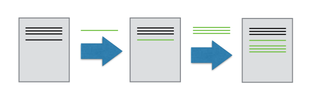
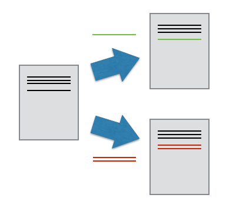
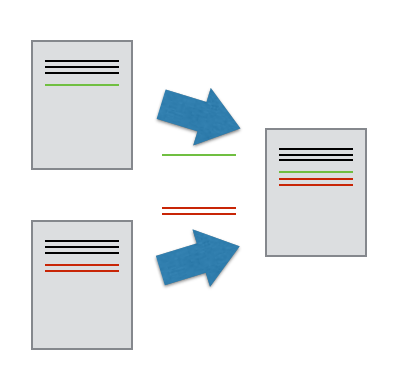

We'll start by exploring how version control can be used
to keep track of what one person did and when.
Even if you aren't collaborating with other people,
automated version control is much better than this situation:

"Piled Higher and Deeper" by Jorge Cham, http://www.phdcomics.com

We've all been in this situation before: it seems ridiculous to have
multiple nearly-identical versions of the same document. Some word
processors let us deal with this a little better, such as Microsoft
Word's [Track Changes](https://support.office.com/en-us/article/Track-changes-in-Word-197ba630-0f5f-4a8e-9a77-3712475e806a), Google Docs' [version
history](https://support.google.com/docs/answer/190843?hl=en), or LibreOffice's [Recording and Displaying Changes](https://help.libreoffice.org/Common/Recording_and_Displaying_Changes).

Version control systems start with a base version of the document and
then record changes you make each step of the way. You can
think of it as a recording of your progress: you can rewind to start at the base
document and play back each change you made, eventually arriving at your
more recent version.

Once you think of changes as separate from the document itself, you
can then think about "playing back" different sets of changes on the base document, ultimately
resulting in different versions of that document. For example, two users can make independent
sets of changes on the same document. 

Unless there are conflicts, you can even incorporate two sets of changes into the same base document.

A version control system is a tool that keeps track of these changes for us,
effectively creating different versions of our files. It allows us to
decide which changes will be made to the next version (each record of these changes is called a
[commit]({{ page.root }}/reference#commit)), and keeps useful metadata about them. The
complete history of commits for a particular project and their metadata make up
a [repository]({{ page.root }}/reference#repository). Repositories can be kept in sync
across different computers, facilitating collaboration among different people.

> ## The Long History of Version Control Systems
>
> Automated version control systems are nothing new.
> Tools like RCS, CVS, or Subversion have been around since the early 1980s and are used by many large companies.
> However, many of these are now considered legacy systems (i.e., outdated) due to various limitations in their capabilities.
> More modern systems, such as Git and [Mercurial](https://swcarpentry.github.io/hg-novice/),
> are *distributed*, meaning that they do not need a centralized server to host the repository.
> These modern systems also include powerful merging tools that make it possible for multiple authors to work on
> the same files concurrently.
{: .callout}

> ## Paper Writing
>
> *   Imagine you drafted an excellent paragraph for a paper you are writing, but later ruin it. How would you retrieve
>     the *excellent* version of your conclusion? Is it even possible?
>
> *   Imagine you have 5 co-authors. How would you manage the changes and comments they make to your paper?
>     If you use LibreOffice Writer or Microsoft Word, what happens if you accept changes made using the
>     `Track Changes` option? Do you have a history of those changes?
{: .challenge}
