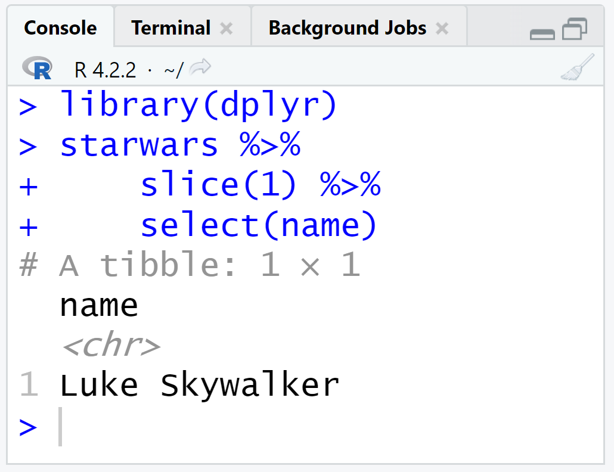
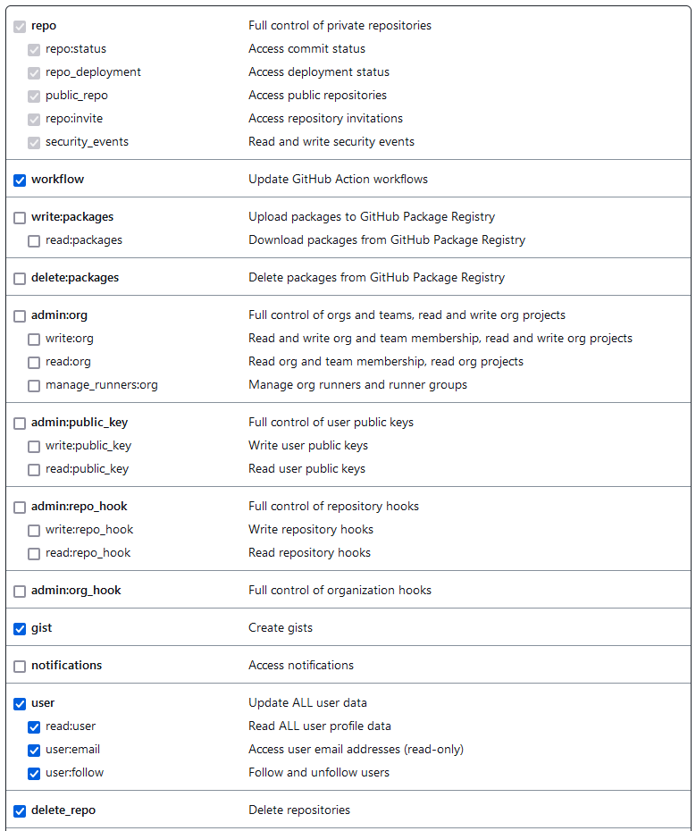

::::::::::::::::::::::::::::::::::::::: objectives

- Configure `git` the first time it is used on a computer.

::::::::::::::::::::::::::::::::::::::::::::::::::

:::::::::::::::::::::::::::::::::::::::: questions

- How do I get set up to use Git?
- What is a token?
- What is a `commit`?
- What is a `repository`?
- What is a `branch`?

::::::::::::::::::::::::::::::::::::::::::::::::::

## The `Git` workflow

A version control system is a tool that keeps track of these changes for us, effectively creating different versions of our files. Each record of these changes is called a [commit](../learners/reference.md#commit). Each keeps useful metadata about them. Instead of _saving copies_ with different file names, we are _making commits_ in the same file. Consecutive commits generate a linear history of changes.

{alt='Changes Are Saved Sequentially'}

The complete history of commits for a particular project and their
metadata make up a [repository](../learners/reference.md#repository).
Repositories can be kept in sync across different computers, facilitating
collaboration among different people.

Before creating our first repository, we need to setup Git. So, let's open Rstudio and introduce yourself to Git!

<!--
{alt='Changes Are Saved Sequentially'}
-->

::::::::::::::::::: prereq

### The Rstudio Console

In this episode, we are going to use the [Rstudio Console](https://docs.posit.co/ide/user/ide/guide/code/console.html).



::::::::::::::::::::::::::

## Set up `Git`

When we use Git on a new computer for the first time,
we need to configure a few things. Below are a few examples of configurations we will set as we get started with Git:

- our name and email address,
<!--- what our preferred text editor is,-->
- and that we want to use these settings globally (i.e. for every project).

You can set your Git user name and email from within R using the `{usethis}` package.

Using the [Rstudio Console](https://docs.posit.co/ide/user/ide/guide/code/console.html), here is how Dracula sets up his new laptop:

```r
# install if needed (do this exactly once):
# install.packages("usethis")

usethis::use_git_config(
  user.name = "Vlad Dracula",
  user.email = "vlad@tran.sylvan.ia",
  github.user = "vlad")
```

Substitute this chunk with your name and __the email associated with your GitHub account__.

<!--
::::::::::::::::::: instructor

On a command line, Git commands are written as `git verb options`,
where `verb` is what we actually want to do and `options` is additional optional information which may be needed for the `verb`. 

```bash
$ git config --global user.name "Vlad Dracula"
$ git config --global user.email "vlad@tran.sylvan.ia"
```

::::::::::::::::::::::::::::::
-->

Please use your own name and email address instead of Dracula's. This user name and email will be associated with your subsequent Git activity,
which means that any changes pushed to
[GitHub](https://github.com/),
[BitBucket](https://bitbucket.org/),
[GitLab](https://gitlab.com/) or
another Git host server
after this lesson will include this information.

For this lesson, we will be interacting with [GitHub](https://github.com/) and so the email address used should be the same as the one used when setting up your GitHub account. If you are concerned about privacy, please review [GitHub's instructions for keeping your email address private][git-privacy].

:::::::::::::::::::::::::::::::::::::::::  callout

## Keeping your email private

If you elect to use a private email address with GitHub, then use that same email address for the `user.email` value, e.g. `username@users.noreply.github.com` replacing `username` with your GitHub one.


::::::::::::::::::::::::::::::::::::::::::::::::::

<!--

:::::::::::::::::::::::::::::::::::::::::  callout

## Line Endings

As with other keys, when you hit <kbd>Enter</kbd> or <kbd>↵</kbd> or on Macs, <kbd>Return</kbd> on your keyboard,
your computer encodes this input as a character.
Different operating systems use different character(s) to represent the end of a line.
(You may also hear these referred to as newlines or line breaks.)
Because Git uses these characters to compare files,
it may cause unexpected issues when editing a file on different machines.
Though it is beyond the scope of this lesson, you can read more about this issue
[in the Pro Git book](https://www.git-scm.com/book/en/v2/Customizing-Git-Git-Configuration#_core_autocrlf).

You can change the way Git recognizes and encodes line endings
using the `core.autocrlf` command to `git config`.
The following settings are recommended:

On macOS and Linux:

```bash
$ git config --global core.autocrlf input
```

And on Windows:

```bash
$ git config --global core.autocrlf true
```

::::::::::::::::::::::::::::::::::::::::::::::::::

-->

<!--

Dracula also has to set his favorite text editor, following this table:

| Editor                                | Configuration command | 
| :-----------                          | :------------------------------ |
| Atom                                  | `$ git config --global core.editor "atom --wait"`                      | 
| nano                                  | `$ git config --global core.editor "nano -w"`                      | 
| BBEdit (Mac, with command line tools) | `$ git config --global core.editor "bbedit -w"`                      | 
| Sublime Text (Mac)                    | `$ git config --global core.editor "/Applications/Sublime\ Text.app/Contents/SharedSupport/bin/subl -n -w"`                      | 
| Sublime Text (Win, 32-bit install)    | `$ git config --global core.editor "'c:/program files (x86)/sublime text 3/sublime_text.exe' -w"`                      | 
| Sublime Text (Win, 64-bit install)    | `$ git config --global core.editor "'c:/program files/sublime text 3/sublime_text.exe' -w"`                      | 
| Notepad (Win)                         | `$ git config --global core.editor "c:/Windows/System32/notepad.exe"`                      | 
| Notepad++ (Win, 32-bit install)       | `$ git config --global core.editor "'c:/program files (x86)/Notepad++/notepad++.exe' -multiInst -notabbar -nosession -noPlugin"`                      | 
| Notepad++ (Win, 64-bit install)       | `$ git config --global core.editor "'c:/program files/Notepad++/notepad++.exe' -multiInst -notabbar -nosession -noPlugin"`                      | 
| Kate (Linux)                          | `$ git config --global core.editor "kate"`                      | 
| Gedit (Linux)                         | `$ git config --global core.editor "gedit --wait --new-window"`                      | 
| Scratch (Linux)                       | `$ git config --global core.editor "scratch-text-editor"`                      | 
| Emacs                                 | `$ git config --global core.editor "emacs"`                      | 
| Vim                                   | `$ git config --global core.editor "vim"`                      | 
| VS Code                               | `$ git config --global core.editor "code --wait"`                      | 

It is possible to reconfigure the text editor for Git whenever you want to change it.

:::::::::::::::::::::::::::::::::::::::::  callout

## Exiting Vim

Note that Vim is the default editor for many programs. If you haven't used Vim before and wish to exit a session without saving
your changes, press <kbd>Esc</kbd> then type `:q!` and hit <kbd>Enter</kbd> or <kbd>↵</kbd> or on Macs, <kbd>Return</kbd>.
If you want to save your changes and quit, press <kbd>Esc</kbd> then type `:wq` and hit <kbd>Enter</kbd> or <kbd>↵</kbd> or on Macs, <kbd>Return</kbd>.


::::::::::::::::::::::::::::::::::::::::::::::::::

-->

## Set up your GitHub token

To interact with GitHub we need to include credentials in the request. We are going to configure one type of credential called _Personal Access Token (PAT)_. We need this to prove that we are a specific GitHub user, allowed to do whatever we’re asking to do. ([Bryan, 2021](https://happygitwithr.com/https-pat.html))

__First, let's create your token.__

Do this with `usethis::create_github_token()`. This function should redirect you to GitHub on your browser. Once there, check all the options in the figure below.

```r
usethis::create_github_token()
```

Describe the token use case.

Check all of the following options:



Copy your token. Save it for the next step.

__Second, let's configure your token.__

To complete the configuration of your token use `gitcreds::gitcreds_set()` ([Bryan, 2021](https://happygitwithr.com/https-pat.html)), then accept that you want to `Replace these credentials`. Write the corresponding number and press ENTER.

```r
gitcreds::gitcreds_set()
```

```output
-> What would you like to do? 

1: Abort update with error, and keep the existing credentials
2: Replace these credentials
3: See the password / token

Selection: 2

```

Paste your `token` to save it and complete this step.

__Lastly, let's confirm your setting.__

Run:

```r
usethis::git_sitrep()
```

In the `── Git global (user)` section, the two first lines of the output should look like this:

```output
── Git global (user) 
• Name: 'Vlad Dracula'
• Email: 'vlad@tran.sylvan.ia'
```

In the `── GitHub user` section, the three first lines of the output should look like this:

```output
── GitHub user 
• Default GitHub host: 'https://github.com'
• Personal access token for 'https://github.com': '<discovered>'
• GitHub user: 'vlad'
```

<!--
```r
gh::gh_whoami()
```

```output
{
  "name": "Vlad Dracula",
  "login": "vlad",
  "html_url": "https://github.com/vlad",
  "scopes": "gist, repo, workflow",
  "token": "gho_...AlAn"
} 
```
-->

You should recognize your:

- Name,
- GitHub login, and
- Token.


## Set up a default `branch` name

As we mentioned before, the complete history of `commits` for a particular project and their metadata make up a `repository`. (We are going to create one in the next episode!)

A [`branch`](https://glosario.carpentries.org/en/#git_branch) is a snapshot of a version of a repository. In that sense, a repository can have more that one branch. WHAT?!! How is that possible? We are going to see that in coming episodes!


Git (2.28+) allows configuration of the name of the branch created when you
initialize any new repository.  Dracula decides to use that feature to set it to `main` so
it matches the cloud service he will eventually use.

Run the code chunk below:

```r
usethis::git_default_branch_configure(name = "main")
```

To confirm this setting, run:

```r
usethis::git_sitrep()
```

In the `── Git local (project)` section, almost at the end of the message, the third line of the output should say `Default branch: 'main'`:

```ouput
── Git local (project) 
• Name: 'Vlad Dracula'
• Email: 'vlad@tran.sylvan.ia'
• Default branch: 'main'
```

<!--
```r
gert::git_branch()
```

```output
[1] "main"
```
-->

<!--
::::::::::::::::::: instructor

On a command line

```bash
$ git config --global init.defaultBranch main
```

::::::::::::::::::::::::::::::
-->

:::::::::::::::::::::::::::::::::::::::::  instructor

## Default Git branch naming

Source file changes are associated with a "branch."
For new learners in this lesson, it's enough to know that branches exist, and this lesson uses one branch.  
By default, Git will create a branch called `master`
when you create a new repository with `git init` (as explained in the next Episode). This term evokes
the racist practice of human slavery and the
[software development community](https://github.com/github/renaming)  has moved to adopt
more inclusive language.

In 2020, most Git code hosting services transitioned to using `main` as the default
branch. As an example, any new repository that is opened in GitHub and GitLab default
to `main`.  However, Git has not yet made the same change.  As a result, local repositories
must be manually configured have the same main branch name as most cloud services.

For versions of Git prior to 2.28, the change can be made on an individual repository level.  The
command for this is in the next episode.  Note that if this value is unset in your local Git
configuration, the `init.defaultBranch` value defaults to `master`.

::::::::::::::::::::::::::::::::::::::::::::::::::

::::::::::::::::: checklist

### Checklist

We need to run these commands __only once__! Git will use this settings for every project, in your user account, on this computer. 

:::::::::::::::::::::::::::

<!--
::::::::::::::::::: instructor

With git commands:

```bash
$ git config --global --edit
```

Let's close the file without making any additional changes.  Remember, since typos in the config file will cause
issues, it's safer to view the configuration with:

```bash
$ git config --list
```

::::::::::::::::::::::::::::::
-->

And if necessary, change your configuration using the
same commands to update your email address.
This can be done as many times as you want.


:::::::::::::::::::::::::::::::::::::::::  callout

## Proxy

In some networks you need to use a
[proxy](https://en.wikipedia.org/wiki/Proxy_server). If this is the case, you
may also need to tell Git about the proxy:

```bash
$ git config --global http.proxy proxy-url
$ git config --global https.proxy proxy-url
```

To disable the proxy, use

```bash
$ git config --global --unset http.proxy
$ git config --global --unset https.proxy
```

::::::::::::::::::::::::::::::::::::::::::::::::::


<!--

:::::::::::::::::::::::::::::::::::::::::  callout

## Git Help and Manual

Always remember that if you forget the subcommands or options of a `git` command, you can access the
relevant list of options typing `git <command> -h` or access the corresponding Git manual by typing
`git <command> --help`, e.g.:

```bash
$ git config -h
$ git config --help
```

While viewing the manual, remember the `:` is a prompt waiting for commands and you can press <kbd>Q</kbd> to exit the manual.

More generally, you can get the list of available `git` commands and further resources of the Git manual typing:

```bash
$ git help
```

::::::::::::::::::::::::::::::::::::::::::::::::::

-->

::::::::::::::::: instructor

When using `usethis::git_sitrep()`, check if there is no `✖ ...` line in the output with an error message. 

Some common errors are solved here:

- [Happy Git with R ebook](https://happygitwithr.com/https-pat.html#pat-troubleshooting)
- [Workbench documentation](https://carpentries.github.io/sandpaper-docs/github-pat.html#common-token-errors)

:::::::::::::::::::::::::

::::::::::::::::: callout

When using the [Terminal](https://glosario.carpentries.org/en/#console), this steps is known as `git config` for `--global` option. In the next chapter we are going to interact with the Terminal!

:::::::::::::::::::::::::

<!--
If you are interested on this, [take a look to this chapter of the happygitwithr ebook](https://happygitwithr.com/hello-git).
-->

[git-privacy]: https://help.github.com/articles/keeping-your-email-address-private/

:::::::::::::::::::::::::::::::::::::::: keypoints

- Use the `{usethis}` package to configure a user name, email address, and other preferences once per machine.
- Use `usethis::use_git_config()` to configure git in Rstudio.
- Use `usethis::git_default_branch_configure()` to define default branch name.
- Use `usethis::git_sitrep()` to verify your configuration.

::::::::::::::::::::::::::::::::::::::::::::::::::


