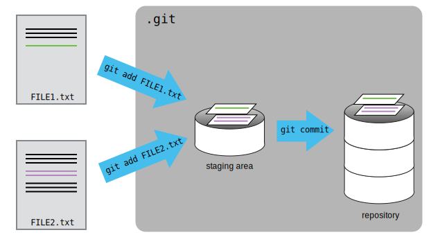

First let's make sure we're still in the right directory.
You should be in the `planets` directory.

~~~
$ pwd
~~~
{: .language-bash}
~~~
/home/vlad/Desktop/planets
~~~
{: .output}

If you are still in `moons`, navigate back up to `planets`

~~~
$ pwd
~~~
{: .language-bash}
~~~
/home/vlad/Desktop/planets/moons
~~~
{: .output}
~~~
$ cd ..
~~~
{: .language-bash}

Let's create a file called `mars.txt` that contains some notes
about the Red Planet's suitability as a base.
We'll use `nano` to edit the file;
you can use whatever editor you like.
In particular, this does not have to be the `core.editor` you set globally earlier. But remember, the bash command to create or edit a new file will depend on the editor you choose (it might not be `nano`). For a refresher on text editors, check out ["Which Editor?"](https://swcarpentry.github.io/shell-novice/03-create/) in [The Unix Shell](https://swcarpentry.github.io/shell-novice/) lesson.

~~~
$ nano mars.txt
~~~
{: .language-bash}

Type the text below into the `mars.txt` file:

~~~
Cold and dry, but everything is my favorite color
~~~

`mars.txt` now contains a single line, which we can see by running:

~~~
$ ls
~~~
{: .language-bash}

~~~
mars.txt
~~~
{: .output}

~~~
$ cat mars.txt
~~~
{: .language-bash}

~~~
Cold and dry, but everything is my favorite color
~~~
{: .output}

If we check the status of our project again,
Git tells us that it's noticed the new file:

~~~
$ git status
~~~
{: .language-bash}

~~~
On branch master

Initial commit

Untracked files:
   (use "git add <file>..." to include in what will be committed)

	mars.txt
nothing added to commit but untracked files present (use "git add" to track)
~~~
{: .output}

The "untracked files" message means that there's a file in the directory
that Git isn't keeping track of.
We can tell Git to track a file using `git add`:

~~~
$ git add mars.txt
~~~
{: .language-bash}

and then check that the right thing happened:

~~~
$ git status
~~~
{: .language-bash}

~~~
On branch master

Initial commit

Changes to be committed:
  (use "git rm --cached <file>..." to unstage)

	new file:   mars.txt

~~~
{: .output}

Git now knows that it's supposed to keep track of `mars.txt`,
but it hasn't recorded these changes as a commit yet.
To get it to do that,
we need to run one more command:

~~~
$ git commit -m "Start notes on Mars as a base"
~~~
{: .language-bash}

~~~
[master (root-commit) f22b25e] Start notes on Mars as a base
 1 file changed, 1 insertion(+)
 create mode 100644 mars.txt
~~~
{: .output}

When we run `git commit`,
Git takes everything we have told it to save by using `git add`
and stores a copy permanently inside the special `.git` directory.
This permanent copy is called a [commit]({{ page.root }}/reference#commit)
(or [revision]({{ page.root }}/reference#revision)) and its short identifier is `f22b25e`.
Your commit may have another identifier.

We use the `-m` flag (for "message")
to record a short, descriptive, and specific comment that will help us remember later on what we did and why.
If we just run `git commit` without the `-m` option,
Git will launch `nano` (or whatever other editor we configured as `core.editor`)
so that we can write a longer message.

[Good commit messages][commit-messages] start with a brief (<50 characters) statement about the
changes made in the commit. Generally, the message should complete the sentence "If applied, this commit will" <commit message here>.
If you want to go into more detail, add a blank line between the summary line and your additional notes. Use this additional space to explain why you made changes and/or what their impact will be.

If we run `git status` now:

~~~
$ git status
~~~
{: .language-bash}

~~~
On branch master
nothing to commit, working directory clean
~~~
{: .output}

it tells us everything is up to date.
If we want to know what we've done recently,
we can ask Git to show us the project's history using `git log`:

~~~
$ git log
~~~
{: .language-bash}

~~~
commit f22b25e3233b4645dabd0d81e651fe074bd8e73b
Author: Vlad Dracula <vlad@tran.sylvan.ia>
Date:   Thu Aug 22 09:51:46 2013 -0400

    Start notes on Mars as a base
~~~
{: .output}

`git log` lists all commits  made to a repository in reverse chronological order.
The listing for each commit includes
the commit's full identifier
(which starts with the same characters as
the short identifier printed by the `git commit` command earlier),
the commit's author,
when it was created,
and the log message Git was given when the commit was created.

> ## Where Are My Changes?
>
> If we run `ls` at this point, we will still see just one file called `mars.txt`.
> That's because Git saves information about files' history
> in the special `.git` directory mentioned earlier
> so that our filesystem doesn't become cluttered
> (and so that we can't accidentally edit or delete an old version).
{: .callout}

Now suppose Dracula adds more information to the file.
(Again, we'll edit with `nano` and then `cat` the file to show its contents;
you may use a different editor, and don't need to `cat`.)

~~~
$ nano mars.txt
$ cat mars.txt
~~~
{: .language-bash}

~~~
Cold and dry, but everything is my favorite color
The two moons may be a problem for Wolfman
~~~
{: .output}

When we run `git status` now,
it tells us that a file it already knows about has been modified:

~~~
$ git status
~~~
{: .language-bash}

~~~
On branch master
Changes not staged for commit:
  (use "git add <file>..." to update what will be committed)
  (use "git checkout -- <file>..." to discard changes in working directory)

	modified:   mars.txt

no changes added to commit (use "git add" and/or "git commit -a")
~~~
{: .output}

The last line is the key phrase:
"no changes added to commit".
We have changed this file,
but we haven't told Git we will want to save those changes
(which we do with `git add`)
nor have we saved them (which we do with `git commit`).
So let's do that now. It is good practice to always review
our changes before saving them. We do this using `git diff`.
This shows us the differences between the current state
of the file and the most recently saved version:

~~~
$ git diff
~~~
{: .language-bash}

~~~
diff --git a/mars.txt b/mars.txt
index df0654a..315bf3a 100644
--- a/mars.txt
+++ b/mars.txt
@@ -1 +1,2 @@
 Cold and dry, but everything is my favorite color
+The two moons may be a problem for Wolfman
~~~
{: .output}

The output is cryptic because
it is actually a series of commands for tools like editors and `patch`
telling them how to reconstruct one file given the other.
If we break it down into pieces:

1.  The first line tells us that Git is producing output similar to the Unix `diff` command
    comparing the old and new versions of the file.
2.  The second line tells exactly which versions of the file
    Git is comparing;
    `df0654a` and `315bf3a` are unique computer-generated labels for those versions.
3.  The third and fourth lines once again show the name of the file being changed.
4.  The remaining lines are the most interesting, they show us the actual differences
    and the lines on which they occur.
    In particular,
    the `+` marker in the first column shows where we added a line.

After reviewing our change, it's time to commit it:

~~~
$ git commit -m "Add concerns about effects of Mars' moons on Wolfman"
$ git status
~~~
{: .language-bash}

~~~
On branch master
Changes not staged for commit:
  (use "git add <file>..." to update what will be committed)
  (use "git checkout -- <file>..." to discard changes in working directory)

	modified:   mars.txt

no changes added to commit (use "git add" and/or "git commit -a")
~~~
{: .output}

Whoops:
Git won't commit because we didn't use `git add` first.
Let's fix that:

~~~
$ git add mars.txt
$ git commit -m "Add concerns about effects of Mars' moons on Wolfman"
~~~
{: .language-bash}

~~~
[master 34961b1] Add concerns about effects of Mars' moons on Wolfman
 1 file changed, 1 insertion(+)
~~~
{: .output}

Git insists that we add files to the set we want to commit
before actually committing anything. This allows us to commit our
changes in stages and capture changes in logical portions rather than
only large batches.
For example,
suppose we're adding a few citations to relevant research to our thesis.
We might want to commit those additions,
and the corresponding bibliography entries,
but *not* commit some of our work drafting the conclusion
(which we haven't finished yet).

To allow for this,
Git has a special *staging area*
where it keeps track of things that have been added to
the current [changeset]({{ page.root }}/reference#changeset)
but not yet committed.

> ## Staging Area
>
> If you think of Git as taking snapshots of changes over the life of a project,
> `git add` specifies *what* will go in a snapshot
> (putting things in the staging area),
> and `git commit` then *actually takes* the snapshot, and
> makes a permanent record of it (as a commit).
> If you don't have anything staged when you type `git commit`,
> Git will prompt you to use `git commit -a` or `git commit --all`,
> which is kind of like gathering *everyone* for the picture!
> However, it's almost always better to
> explicitly add things to the staging area, because you might
> commit changes you forgot you made. (Going back to snapshots,
> you might get the extra with incomplete makeup walking on
> the stage for the snapshot because you used `-a`!)
> Try to stage things manually,
> or you might find yourself searching for "git undo commit" more
> than you would like!
{: .callout}

Let's watch as our changes to a file move from our editor
to the staging area
and into long-term storage.
First,
we'll add another line to the file:

~~~
$ nano mars.txt
$ cat mars.txt
~~~
{: .language-bash}

~~~
Cold and dry, but everything is my favorite color
The two moons may be a problem for Wolfman
But the Mummy will appreciate the lack of humidity
~~~
{: .output}

~~~
$ git diff
~~~
{: .language-bash}

~~~
diff --git a/mars.txt b/mars.txt
index 315bf3a..b36abfd 100644
--- a/mars.txt
+++ b/mars.txt
@@ -1,2 +1,3 @@
 Cold and dry, but everything is my favorite color
 The two moons may be a problem for Wolfman
+But the Mummy will appreciate the lack of humidity
~~~
{: .output}

So far, so good:
we've added one line to the end of the file
(shown with a `+` in the first column).
Now let's put that change in the staging area
and see what `git diff` reports:

~~~
$ git add mars.txt
$ git diff
~~~
{: .language-bash}

There is no output:
as far as Git can tell,
there's no difference between what it's been asked to save permanently
and what's currently in the directory.
However,
if we do this:

~~~
$ git diff --staged
~~~
{: .language-bash}

~~~
diff --git a/mars.txt b/mars.txt
index 315bf3a..b36abfd 100644
--- a/mars.txt
+++ b/mars.txt
@@ -1,2 +1,3 @@
 Cold and dry, but everything is my favorite color
 The two moons may be a problem for Wolfman
+But the Mummy will appreciate the lack of humidity
~~~
{: .output}

it shows us the difference between
the last committed change
and what's in the staging area.
Let's save our changes:

~~~
$ git commit -m "Discuss concerns about Mars' climate for Mummy"
~~~
{: .language-bash}

~~~
[master 005937f] Discuss concerns about Mars' climate for Mummy
 1 file changed, 1 insertion(+)
~~~
{: .output}

check our status:

~~~
$ git status
~~~
{: .language-bash}

~~~
On branch master
nothing to commit, working directory clean
~~~
{: .output}

and look at the history of what we've done so far:

~~~
$ git log
~~~
{: .language-bash}

~~~
commit 005937fbe2a98fb83f0ade869025dc2636b4dad5
Author: Vlad Dracula <vlad@tran.sylvan.ia>
Date:   Thu Aug 22 10:14:07 2013 -0400

    Discuss concerns about Mars' climate for Mummy

commit 34961b159c27df3b475cfe4415d94a6d1fcd064d
Author: Vlad Dracula <vlad@tran.sylvan.ia>
Date:   Thu Aug 22 10:07:21 2013 -0400

    Add concerns about effects of Mars' moons on Wolfman

commit f22b25e3233b4645dabd0d81e651fe074bd8e73b
Author: Vlad Dracula <vlad@tran.sylvan.ia>
Date:   Thu Aug 22 09:51:46 2013 -0400

    Start notes on Mars as a base
~~~
{: .output}

> ## Word-based diffing
>
> Sometimes, e.g. in the case of the text documents a line-wise
> diff is too coarse. That is where the `--color-words` option of
> `git diff` comes in very useful as it highlights the changed
> words using colors.
{: .callout}

> ## Paging the Log
>
> When the output of `git log` is too long to fit in your screen,
> `git` uses a program to split it into pages of the size of your screen.
> When this "pager" is called, you will notice that the last line in your
> screen is a `:`, instead of your usual prompt.
>
> *   To get out of the pager, press <kbd>Q</kbd>.
> *   To move to the next page, press <kbd>Spacebar</kbd>.
> *   To search for `some_word` in all pages,
>     press <kbd>/</kbd>
>     and type `some_word`.
>     Navigate through matches pressing <kbd>N</kbd>.
{: .callout}

> ## Limit Log Size
>
> To avoid having `git log` cover your entire terminal screen, you can limit the
> number of commits that Git lists by using `-N`, where `N` is the number of
> commits that you want to view. For example, if you only want information from
> the last commit you can use:
>
> ~~~
> $ git log -1
> ~~~
> {: .language-bash}
>
> ~~~
> commit 005937fbe2a98fb83f0ade869025dc2636b4dad5
> Author: Vlad Dracula <vlad@tran.sylvan.ia>
> Date:   Thu Aug 22 10:14:07 2013 -0400
>
>    Discuss concerns about Mars' climate for Mummy
> ~~~
> {: .output}
>
> You can also reduce the quantity of information using the
> `--oneline` option:
>
> ~~~
> $ git log --oneline
> ~~~
> {: .language-bash}
> ~~~
> * 005937f Discuss concerns about Mars' climate for Mummy
> * 34961b1 Add concerns about effects of Mars' moons on Wolfman
> * f22b25e Start notes on Mars as a base
> ~~~
> {: .output}
>
> You can also combine the `--oneline` options with others. One useful
> combination is:
>
> ~~~
> $ git log --oneline --graph --all --decorate
> ~~~
> {: .language-bash}
> ~~~
> * 005937f Discuss concerns about Mars' climate for Mummy (HEAD, master)
> * 34961b1 Add concerns about effects of Mars' moons on Wolfman
> * f22b25e Start notes on Mars as a base
> ~~~
> {: .output}
{: .callout}

> ## Directories
>
> Two important facts you should know about directories in Git.
>
> 1. Git does not track directories on their own, only files within them.
>    Try it for yourself:
>
>    ~~~
>    $ mkdir directory
>    $ git status
>    $ git add directory
>    $ git status
>    ~~~
>    {: .language-bash}
>
>    Note, our newly created empty directory `directory` does not appear in
>    the list of untracked files even if we explicitly add it (_via_ `git add`) to our
>    repository. This is the reason why you will sometimes see `.gitkeep` files
>    in otherwise empty directories. Unlike `.gitignore`, these files are not special
>    and their sole purpose is to populate a directory so that Git adds it to
>    the repository. In fact, you can name such files anything you like.
>
> 2. If you create a directory in your Git repository and populate it with files,
>    you can add all files in the directory at once by:
>
>    ~~~
>    git add <directory-with-files>
>    ~~~
>    {: .language-bash}
>
{: .callout}

To recap, when we want to add changes to our repository,
we first need to add the changed files to the staging area
(`git add`) and then commit the staged changes to the
repository (`git commit`):

> ## Choosing a Commit Message
>
> Which of the following commit messages would be most appropriate for the
> last commit made to `mars.txt`?
>
> 1. "Changes"
> 2. "Added line 'But the Mummy will appreciate the lack of humidity' to mars.txt"
> 3. "Discuss effects of Mars' climate on the Mummy"
>
> > ## Solution
> > Answer 1 is not descriptive enough, and the purpose of the commit is unclear;
> > and answer 2 is redundant to using "git diff" to see what changed in this commit;
> > but answer 3 is good: short, descriptive, and imperative.
> {: .solution}
{: .challenge}

> ## Committing Changes to Git
>
> Which command(s) below would save the changes of `myfile.txt`
> to my local Git repository?
>
> 1. ~~~
>    $ git commit -m "my recent changes"
>    ~~~
>    {: .language-bash}
> 2. ~~~
>    $ git init myfile.txt
>    $ git commit -m "my recent changes"
>    ~~~
>    {: .language-bash}
> 3. ~~~
>    $ git add myfile.txt
>    $ git commit -m "my recent changes"
>    ~~~
>    {: .language-bash}
> 4. ~~~
>    $ git commit -m myfile.txt "my recent changes"
>    ~~~
>    {: .language-bash}
>
> > ## Solution
> >
> > 1. Would only create a commit if files have already been staged.
> > 2. Would try to create a new repository.
> > 3. Is correct: first add the file to the staging area, then commit.
> > 4. Would try to commit a file "my recent changes" with the message myfile.txt.
> {: .solution}
{: .challenge}

> ## Committing Multiple Files
>
> The staging area can hold changes from any number of files
> that you want to commit as a single snapshot.
>
> 1. Add some text to `mars.txt` noting your decision
> to consider Venus as a base
> 2. Create a new file `venus.txt` with your initial thoughts
> about Venus as a base for you and your friends
> 3. Add changes from both files to the staging area,
> and commit those changes.
>
> > ## Solution
> >
> > First we make our changes to the `mars.txt` and `venus.txt` files:
> > ~~~
> > $ nano mars.txt
> > $ cat mars.txt
> > ~~~
> > {: .language-bash}
> > ~~~
> > Maybe I should start with a base on Venus.
> > ~~~
> > {: .output}
> > ~~~
> > $ nano venus.txt
> > $ cat venus.txt
> > ~~~
> > {: .language-bash}
> > ~~~
> > Venus is a nice planet and I definitely should consider it as a base.
> > ~~~
> > {: .output}
> > Now you can add both files to the staging area. We can do that in one line:
> >
> > ~~~
> > $ git add mars.txt venus.txt
> > ~~~
> > {: .language-bash}
> > Or with multiple commands:
> > ~~~
> > $ git add mars.txt
> > $ git add venus.txt
> > ~~~
> > {: .language-bash}
> > Now the files are ready to commit. You can check that using `git status`. If you are ready to commit use:
> > ~~~
> > $ git commit -m "Write plans to start a base on Venus"
> > ~~~
> > {: .language-bash}
> > ~~~
> > [master cc127c2]
> >  Write plans to start a base on Venus
> >  2 files changed, 2 insertions(+)
> >  create mode 100644 venus.txt
> > ~~~
> > {: .output}
> {: .solution}
{: .challenge}

> ## `bio` Repository
>
> * Create a new Git repository on your computer called `bio`.
> * Write a three-line biography for yourself in a file called `me.txt`,
> commit your changes
> * Modify one line, add a fourth line
> * Display the differences
> between its updated state and its original state.
>
> > ## Solution
> >
> > If needed, move out of the `planets` folder:
> >
> > ~~~
> > $ cd ..
> > ~~~
> > {: .language-bash}
> >
> > Create a new folder called `bio` and 'move' into it:
> >
> > ~~~
> > $ mkdir bio
> > $ cd bio
> > ~~~
> > {: .language-bash}
> >
> > Initialise git:
> >
> > ~~~
> > $ git init
> > ~~~
> > {: .language-bash}
> >
> > Create your biography file `me.txt` using `nano` or another text editor.
> > Once in place, add and commit it to the repository:
> >
> > ~~~
> > $ git add me.txt
> > $ git commit -m'Adding biography file'
> > ~~~
> > {: .language-bash}
> >
> > Modify the file as described (modify one line, add a fourth line).
> > To display the differences
> > between its updated state and its original state, use `git diff`:
> >
> > ~~~
> > $ git diff me.txt
> > ~~~
> > {: .language-bash}
> >
> {: .solution}
{: .challenge}

> ## Author and Committer
>
> For each of the commits you have done, Git stored your name twice.
> You are named as the author and as the committer. You can observe
> that by telling Git to show you more information about your last
> commits:
>
> ~~~
> $ git log --format=full
> ~~~
> {: .language-bash}
>
> When committing you can name someone else as the author:
>
> ~~~
> $ git commit --author="Vlad Dracula <vlad@tran.sylvan.ia>"
> ~~~
> {: .language-bash}
>
> Create a new repository and create two commits: one without the
> `--author` option and one by naming a colleague of yours as the
> author. Run `git log` and `git log --format=full`. Think about ways
> how that can allow you to collaborate with your colleagues.
>
> > ## Solution
> >
> > ~~~
> > $ git add me.txt
> > $ git commit -m "Update Vlad's bio." --author="Frank N. Stein <franky@monster.com>"
> > ~~~
> > {: .language-bash}
> > ~~~
> > [master 4162a51] Update Vlad's bio.
> > Author: Frank N. Stein <franky@monster.com>
> > 1 file changed, 2 insertions(+), 2 deletions(-)
> >
> > $ git log --format=full
> > commit 4162a51b273ba799a9d395dd70c45d96dba4e2ff
> > Author: Frank N. Stein <franky@monster.com>
> > Commit: Vlad Dracula <vlad@tran.sylvan.ia>
> >
> > Update Vlad's bio.
> >
> > commit aaa3271e5e26f75f11892718e83a3e2743fab8ea
> > Author: Vlad Dracula <vlad@tran.sylvan.ia>
> > Commit: Vlad Dracula <vlad@tran.sylvan.ia>
> >
> > Vlad's initial bio.
> > ~~~
> > {: .output}
> {: .solution}
{: .challenge}

[commit-messages]: https://chris.beams.io/posts/git-commit/
