::::::::::::::::::::::::::::::::::::::: objectives

- Clone a remote repository.
- Collaborate by pushing to a common repository.
- Describe the basic collaborative workflow.

::::::::::::::::::::::::::::::::::::::::::::::::::

:::::::::::::::::::::::::::::::::::::::: questions

- How can I use version control to collaborate with other people?

::::::::::::::::::::::::::::::::::::::::::::::::::

## Paper Writing

From the [first episode](01-basics.md#paper-writing)!

Imagine you have 3 co-authors. How would you manage the changes and comments they make to your paper?  

If you use Google Docs, you can have access to the history of changes, and also identify how made those changes.

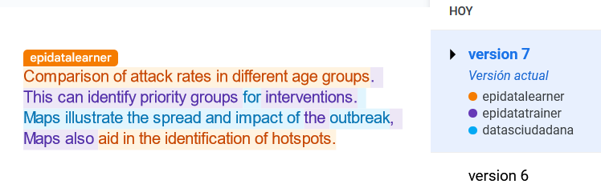

For __plain-text__ files, you can use GitHub to see the changes made per commit. In the left side or in color red are the deletions and in the right side or in color green the additions.

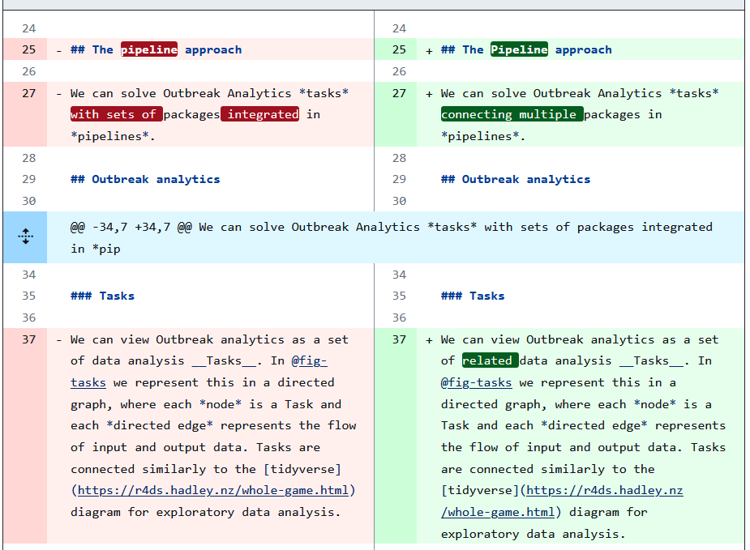

Additionally, in GitHub you can use the option `Blame` to read the authors of changes per line. In this way, you can also read any related comment regarding why an specific line was edited.

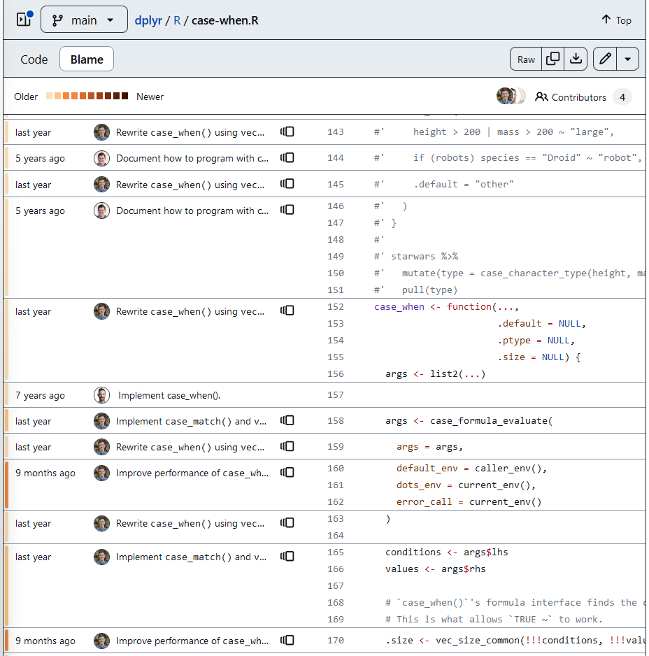

All of these is possible with a _collaboration workflow_ between contributors using Git and GitHub!

::::::::::::::::: checklist

### Checklist

Key characteristics of Version control systems are:

1. Keep the entire history of a file and inspect a file throughout its lifetime.

2. Tag a particular version so you can return to them easily.

<!--3. Experiment with code and feature without breaking the main project-->

3. Facilitates collaborations and makes contributions transparent.

:::::::::::::::::::::::::::

## Get a copy of remote

For the next step, get into pairs.  One person will be the "Owner" and the other
will be the "Collaborator". The goal is that the Collaborator add changes into
the Owner's repository. We will switch roles at the end, so both persons will
play Owner and Collaborator.

:::::::::::::::::::::::::::::::::::::::::  callout

## Practicing By Yourself

If you're working through this lesson on your own, you can carry on by opening
a second terminal window.
This window will represent your partner, working on another computer. You
won't need to give anyone access on GitHub, because both 'partners' are you.


::::::::::::::::::::::::::::::::::::::::::::::::::

The Owner needs to give the Collaborator access. In your repository page on GitHub, click the "Settings"
button on the right, select "Collaborators", click "Add people", and
then enter your partner's username.

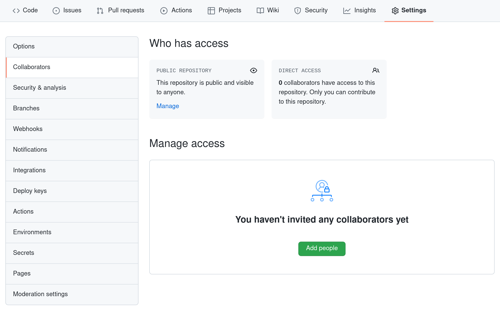{alt='screenshot of repository page with Settings then Collaborators selected, showing how to add Collaborators in a GitHub repository'}

To accept access to the Owner's repo, the Collaborator
needs to go to [https://github.com/notifications](https://github.com/notifications)
or check for email notification. Once there she can accept access to the Owner's repo.

Next, the Collaborator needs to download a copy of the Owner's repository to her
machine. This is called "cloning a repo".

The Collaborator doesn't want to overwrite her own version of `cases.git`, so
needs to clone the Owner's repository to a different location than her own
repository with the same name.

::::::::::::::::: callout

First, if you are in RStudio, close your R Project from `File` > `Close Project`.

:::::::::::::::::::::::::

To clone the Owner's repo into Collaborator's folder, in the Console, the __Collaborator__ enters:

```bash
$ git clone https://github.com/vlad/cases.git vlad-cases
```

<!--
```bash
$ git clone https://github.com/vlad/cases.git ~/Desktop/vlad-cases
```
-->

Replace 'vlad' with the Owner's username.

::::::::::::::::: callout

If you choose to clone without the clone path
(`vlad-cases`) specified at the end,
you will clone inside your own cases folder!
<!--Make sure to navigate to the `Desktop` folder first.-->

__ALSO:__ You only need to add the "clone path" when you have a local folder with the same name as the remote repository. This is not a common addition.

:::::::::::::::::::::::::

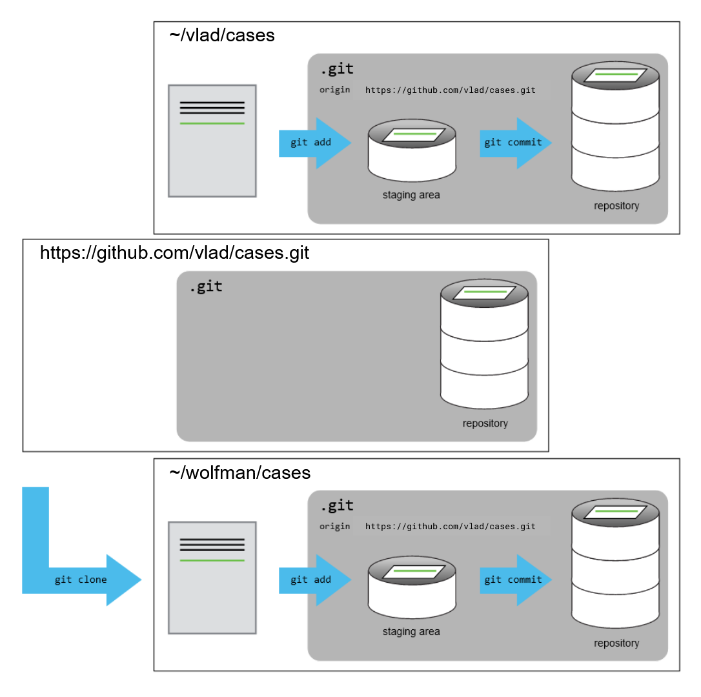{alt='After Creating Clone of Repository'}

## Edit the clone


The __Collaborator__ can now make a change in her clone of the Owner's repository,
exactly the same way as we've been doing before.

<!--
```bash
$ cd ~/Desktop/vlad-cases
$ nano dashboard.Rmd
$ cat dashboard.Rmd
```
-->

First, open the `vlad-cases` R project. If you are in RStudio: `File` > `New Project...` and navigate to the directory location.

Now, let's create a new file called `dashboard.Rmd` to complement our Situation report!

```r
usethis::edit_file("dashboard.Rmd")
```

```output
Let's create a dashboard!
```

```bash
$ git add dashboard.Rmd
$ git commit -m "Add notes about Dashboard"
```

```output
 1 file changed, 1 insertion(+)
 create mode 100644 dashboard.Rmd
```

Then push the change to the *Owner's repository* on GitHub:

```bash
$ git push origin main
```

```output
Enumerating objects: 4, done.
Counting objects: 4, done.
Delta compression using up to 4 threads.
Compressing objects: 100% (2/2), done.
Writing objects: 100% (3/3), 306 bytes, done.
Total 3 (delta 0), reused 0 (delta 0)
To https://github.com/vlad/cases.git
   9272da5..29aba7c  main -> main
```

Note that we didn't have to create a remote called `origin`: Git uses this
name by default when we clone a repository.  (This is why `origin` was a
sensible choice earlier when we were setting up remotes by hand.)

Take a look at the Owner's repository on GitHub again, and you should be
able to see the new commit made by the Collaborator. You may need to refresh
your browser to see the new commit.

:::::::::::::::::::::::::::::::::::::::::  spoiler

## Some more about remotes

In this episode and the previous one, our local repository has had
a single "remote", called `origin`. A remote is a copy of the repository
that is hosted somewhere else, that we can push to and pull from, and
there's no reason that you have to work with only one. For example,
on some large projects you might have your own copy in your own GitHub
account (you'd probably call this `origin`) and also the main "upstream"
project repository (let's call this `upstream` for the sake of examples).
You would pull from `upstream` from time to
time to get the latest updates that other people have committed.

Remember that the name you give to a remote only exists locally. It's
an alias that you choose - whether `origin`, or `upstream`, or `fred` -
and not something intrinstic to the remote repository.

The `git remote` family of commands is used to set up and alter the remotes
associated with a repository. Here are some of the most useful ones:

- `git remote -v` lists all the remotes that are configured (we already used
  this in the last episode)
- `git remote add [name] [url]` is used to add a new remote
- `git remote remove [name]` removes a remote. Note that it doesn't affect the
  remote repository at all - it just removes the link to it from the local repo.
- `git remote set-url [name] [newurl]` changes the URL that is associated
  with the remote. This is useful if it has moved, e.g. to a different GitHub
  account, or from GitHub to a different hosting service. Or, if we made a typo when
  adding it!
- `git remote rename [oldname] [newname]` changes the local alias by which a remote
  is known - its name. For example, one could use this to change `upstream` to `fred`.
  

::::::::::::::::::::::::::::::::::::::::::::::::::

## Download contributor edits

To download the Collaborator's changes from GitHub, in the Console, the __Owner__ now enters:

```bash
$ git pull origin main
```

```output
remote: Enumerating objects: 4, done.
remote: Counting objects: 100% (4/4), done.
remote: Compressing objects: 100% (2/2), done.
remote: Total 3 (delta 0), reused 3 (delta 0), pack-reused 0
Unpacking objects: 100% (3/3), done.
From https://github.com/vlad/cases
 * branch            main     -> FETCH_HEAD
   9272da5..29aba7c  main     -> origin/main
Updating 9272da5..29aba7c
Fast-forward
 dashboard.Rmd | 1 +
 1 file changed, 1 insertion(+)
 create mode 100644 dashboard.Rmd
```

Now the __three repositories__ (Owner's local, Collaborator's local, and Owner's on
GitHub) are back in sync.

:::::::::::::::::::::::::::::::::::::::::  callout

## A Basic Collaborative Workflow

In practice, it is good to be sure that you have an updated version of the
repository you are collaborating on, so you should `git pull` before making
our changes. The basic collaborative workflow would be:

- update your local repo with `git pull origin main`,
- make your changes and stage them with `git add`,
- commit your changes with `git commit -m`, and
- upload the changes to GitHub with `git push origin main`

It is better to make many commits with smaller changes rather than
of one commit with massive changes: small commits are easier to
read and review.


::::::::::::::::::::::::::::::::::::::::::::::::::


:::::::::::::::::::::::::::::::::::::::  challenge

## Review Changes

The Owner pushed commits to the repository without giving any information
to the Collaborator. How can the Collaborator find out what has changed with
command line? And on GitHub?

:::::::::::::::  solution

## Solution

**On GitHub**, the Collaborator can go to the repository and click on
"commits" to view the most recent commits pushed to the repository.

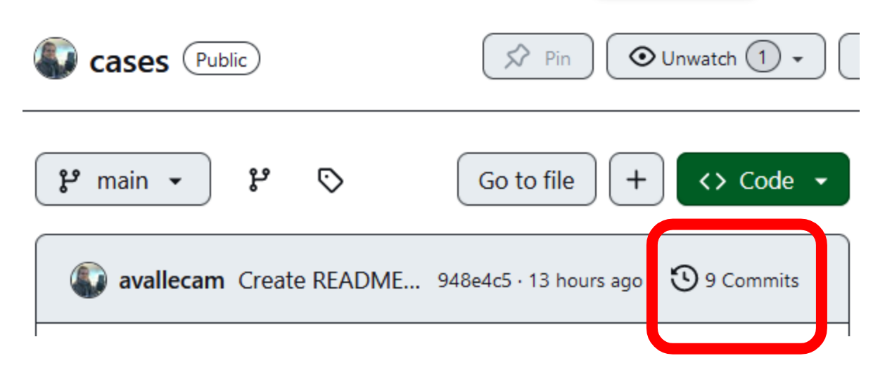

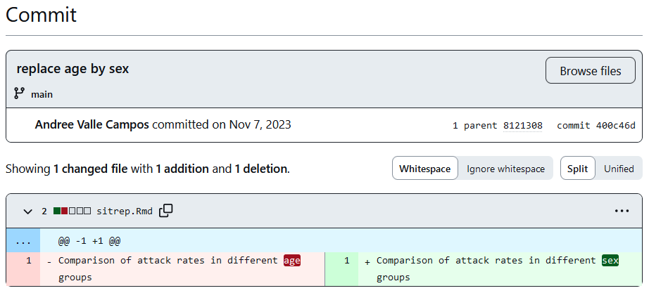

On the **command line**, the Collaborator can use `git fetch origin main`
to get the remote changes into the local repository, but without merging
them. Then by running `git diff main origin/main` the Collaborator
will see the changes output in the terminal.


:::::::::::::::::::::::::

::::::::::::::::::::::::::::::::::::::::::::::::::

## Group challenge

:::::::::::::::::::::::::::::::::::::::  challenge

## Switch Roles and Repeat

Switch roles and repeat the whole process.


::::::::::::::::::::::::::::::::::::::::::::::::::

## Individual challenges

:::::::::::::::::::::::::::::::::::::::  challenge

## Comment Changes in GitHub

The Collaborator has some questions about one line change made by the Owner and
has some suggestions to propose.

With GitHub, it is possible to comment on the diff of a commit. Over the line of
code to comment, a blue comment icon appears to open a comment window.

The Collaborator posts her comments and suggestions using the GitHub interface.


::::::::::::::::::::::::::::::::::::::::::::::::::

:::::::::::::::::::::::::::::::::::::::  challenge

## Version History, Backup, and Version Control

Some backup software can keep a history of the versions of your files. They also
allows you to recover specific versions. How is this functionality different from version control?
What are some of the benefits of using version control, Git and GitHub?


::::::::::::::::::::::::::::::::::::::::::::::::::

::::::::::::::::::::::::::::::::: challenge

### Create your GitHub profile!

Now your work will be visible online on GitHub. Your profile page introduce you to other contributors on GitHub:

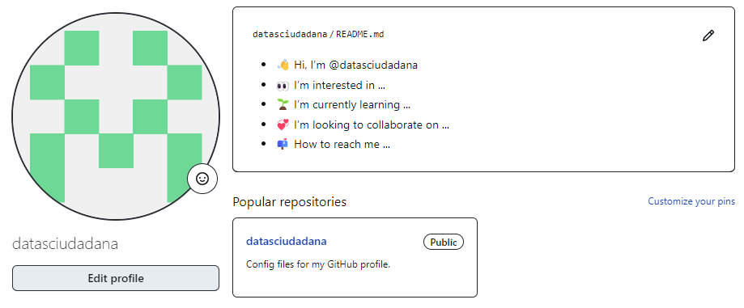

::::::::::::::::: solution

To create this, go to the [GitHub Home page](https://github.com/), identify the section called __Introduce yourself with a profile README__. Click on `Create`:

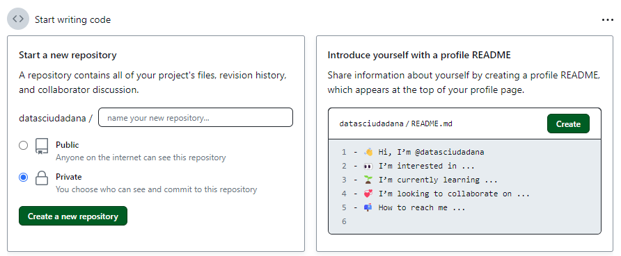

Edit the lines in the template file. Then click on `Commit changes...`

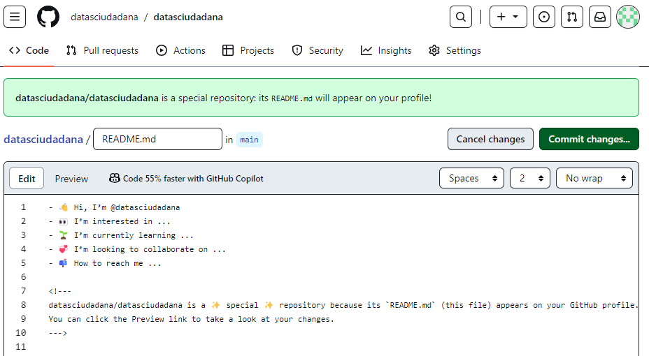

To edit this in a local repository, clone it following the steps you learned!

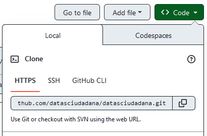

::::::::::::::::::::::::::

:::::::::::::::::::::::::::::::::::::::::::

::::::::::::::::: checklist


:::::::::::::::::::::::::::

:::::::::::::::::::::::::::::::::::::::: keypoints

- `git clone` copies a remote repository to create a local repository with a remote called `origin` automatically set up.

::::::::::::::::::::::::::::::::::::::::::::::::::


