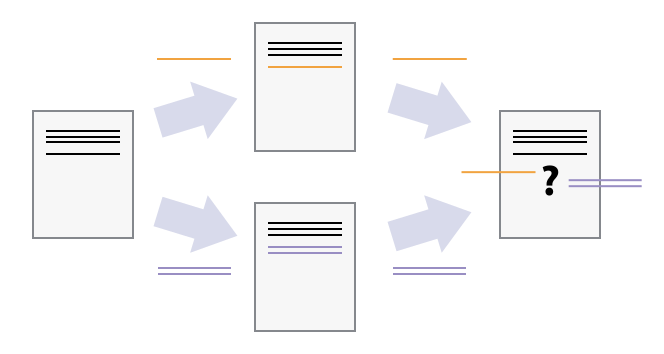
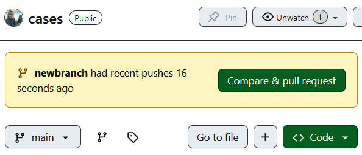
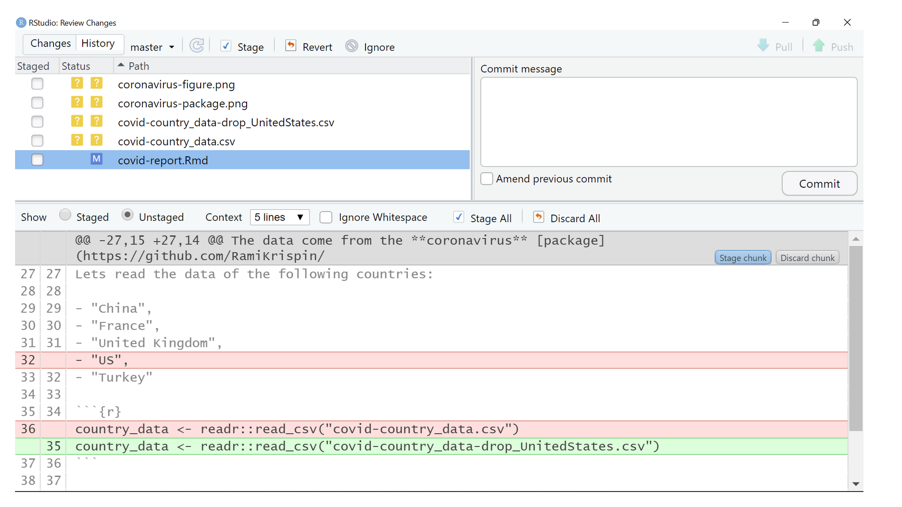
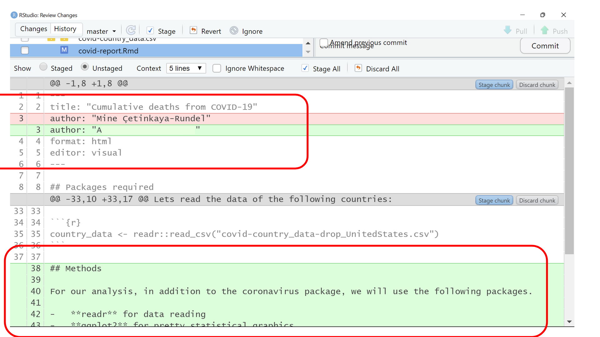

::::::::::::::::::::::::::::::::::::::: objectives

- Explain what conflicts are and when they can occur.
- Resolve conflicts resulting from a merge.

::::::::::::::::::::::::::::::::::::::::::::::::::

:::::::::::::::::::::::::::::::::::::::: questions

- What do I do when my changes conflict with someone else's?

::::::::::::::::::::::::::::::::::::::::::::::::::

## A story of two collaborators

Two users can make independent
sets of changes on the same document.

{alt='Different Versions Can be Saved'}

If multiple users make changes to different sections of the document you can
incorporate two sets of changes into the same base document.

{alt='Multiple Versions Can be Merged'}

However, if multiple users make changes to the same sections of the document, this will generate a conflict.

{alt='The Conflicting Changes'}

As soon as people can work in parallel, they'll likely step on each other's
toes.  This will even happen with a single person: if we are working on
a piece of software on both our laptop and a server in the lab, we could make
different changes to each copy.  Version control helps us manage these
[conflicts](../learners/reference.md#conflict) by giving us tools to
[resolve](../learners/reference.md#resolve) overlapping changes.

Before resolving conflicts, we'll review two features that a **good collaborator** puts in practice: [Create branches](09-conflict.md#create-branches) and make [Atomic commits](09-conflict.md#atomic-commits).

## Group Challenge

:::::::::::::::::::::::::::::::::::::::  challenge

## A Typical Work Session

You sit down at your computer to work on a shared project that is tracked in a
remote Git repository. During your work session, you take the following
actions, but not in this order:

- *Make changes* by appending the number `100` to a text file `numbers.md`
- *Update remote* repository to match the local repository
- *Celebrate* your success with some fancy beverage(s)
- *Update local* repository to match the remote repository
- *Stage changes* to be committed
- *Commit changes* to the local repository

In what order should you perform these actions to minimize the chances of
conflicts? Put the commands above in order in the *action* column of the table
below. When you have the order right, see if you can write the corresponding
commands in the *command* column. A few steps are populated to get you
started.

| order | action . . . . . . | command . . . . . . . . . .                   | 
| ----- | -------------------------- | --------------------------------------------- |
| 1     |                            |                                               | 
| 2     |                            | `echo 100 >> numbers.md`                                              | 
| 3     |                            |                                               | 
| 4     |                            |                                               | 
| 5     |                            |                                               | 
| 6     | Celebrate!                 | `AFK`                                              | 

:::::::::::::::  solution

## Solution

| order | action . . . . . .         | command . . . . . . . . . . . . . . . . . . . | 
| ----- | -------------------------- | --------------------------------------------- |
| 1     | Update local               | `git pull origin main`                                              | 
| 2     | Make changes               | `echo 100 >> numbers.md`                                              | 
| 3     | Stage changes              | `git add numbers.md`                                              | 
| 4     | Commit changes             | `git commit -m "Add 100 to numbers.md"`                                              | 
| 5     | Update remote              | `git push origin main`                                              | 
| 6     | Celebrate!                 | `AFK`                                              | 

:::::::::::::::::::::::::

::::::::::::::::::::::::::::::::::::::::::::::::::

## Create a conflict

To see how we can resolve conflicts, we must first create one.  The file
`sitrep.Rmd` currently looks like this in both partners' copies of our `cases`
repository:

```r
usethis::edit_file("sitrep.Rmd")
```

<!--
```bash
$ cat sitrep.Rmd
```
-->

```output
Comparison of attack rates in different age groups
This can identify priority groups for interventions
Maps illustrate the spread and impact of outbreak
```

Let's add a line to the __collaborator's__ copy only:

```r
usethis::edit_file("sitrep.Rmd")
```

<!--
```bash
$ nano sitrep.Rmd
$ cat sitrep.Rmd
```
-->

```output
Comparison of attack rates in different age groups
This can identify priority groups for interventions
Maps illustrate the spread and impact of outbreak
This line added to Wolfman's copy
```

and then push the change to GitHub:

```bash
$ git add sitrep.Rmd
$ git commit -m "Add a line in our home copy"
```

```output
[main 5ae9631] Add a line in our home copy
 1 file changed, 1 insertion(+)
```

```bash
$ git push origin main
```

```output
Enumerating objects: 5, done.
Counting objects: 100% (5/5), done.
Delta compression using up to 8 threads
Compressing objects: 100% (3/3), done.
Writing objects: 100% (3/3), 331 bytes | 331.00 KiB/s, done.
Total 3 (delta 2), reused 0 (delta 0)
remote: Resolving deltas: 100% (2/2), completed with 2 local objects.
To https://github.com/vlad/cases.git
   29aba7c..dabb4c8  main -> main
```

Now let's have the __owner__
make a different change to their copy
*without* updating from GitHub:

```r
usethis::edit_file("sitrep.Rmd")
```

<!--
```bash
$ nano sitrep.Rmd
$ cat sitrep.Rmd
```
-->

```output
Comparison of attack rates in different age groups
This can identify priority groups for interventions
Maps illustrate the spread and impact of outbreak
We added a different line in the other copy
```

We can commit the change locally:

```bash
$ git add sitrep.Rmd
$ git commit -m "Add a line in my copy"
```

```output
[main 07ebc69] Add a line in my copy
 1 file changed, 1 insertion(+)
```

but Git won't let us push it to GitHub:

```bash
$ git push origin main
```

```output
To https://github.com/vlad/cases.git
 ! [rejected]        main -> main (fetch first)
error: failed to push some refs to 'https://github.com/vlad/cases.git'
hint: Updates were rejected because the remote contains work that you do
hint: not have locally. This is usually caused by another repository pushing
hint: to the same ref. You may want to first integrate the remote changes
hint: (e.g., 'git pull ...') before pushing again.
hint: See the 'Note about fast-forwards' in 'git push --help' for details.
```

{alt='The Conflicting Changes'}

Git rejects the push because it detects that the remote repository has new updates that have not been
incorporated into the local branch.
What we have to do is `pull` the changes from GitHub,
[`merge`](../learners/reference.md#merge) them into the copy we're currently working in, and then push that.

## Resolve conflict

The __owner__ need to solve this conflict to be able to push to the remote repository. 

Let's start by pulling:

```bash
$ git pull origin main
```

```output
remote: Enumerating objects: 5, done.
remote: Counting objects: 100% (5/5), done.
remote: Compressing objects: 100% (1/1), done.
remote: Total 3 (delta 2), reused 3 (delta 2), pack-reused 0
Unpacking objects: 100% (3/3), done.
From https://github.com/vlad/cases
 * branch            main     -> FETCH_HEAD
    29aba7c..dabb4c8  main     -> origin/main
Auto-merging sitrep.Rmd
CONFLICT (content): Merge conflict in sitrep.Rmd
Automatic merge failed; fix conflicts and then commit the result.
```

The `git pull` command updates the local repository to include those
changes already included in the remote repository.
After the changes from remote branch have been fetched, Git detects that changes made to the local copy
overlap with those made to the remote repository, and therefore refuses to merge the two versions to
stop us from trampling on our previous work. The conflict is marked in
in the affected file:

```r
usethis::edit_file("sitrep.Rmd")
```

<!--
```bash
$ cat sitrep.Rmd
```
-->

```output
Comparison of attack rates in different age groups
This can identify priority groups for interventions
Maps illustrate the spread and impact of outbreak
<<<<<<< HEAD
We added a different line in the other copy
=======
This line added to Wolfman's copy
>>>>>>> dabb4c8c450e8475aee9b14b4383acc99f42af1d
```

Our change is preceded by `<<<<<<< HEAD`.
Git has then inserted `=======` as a separator between the conflicting changes
and marked the end of the content downloaded from GitHub with `>>>>>>>`.
(The string of letters and digits after that marker
identifies the commit we've just downloaded.)

It is now up to us to edit this file to remove these markers
and reconcile the changes.
We can do anything we want: keep the change made in the local repository, keep
the change made in the remote repository, write something new to replace both,
or get rid of the change entirely.
Let's replace both so that the file looks like this:

```r
usethis::edit_file("sitrep.Rmd")
```

<!--
```bash
$ cat sitrep.Rmd
```
-->

```output
Comparison of attack rates in different age groups
This can identify priority groups for interventions
Maps illustrate the spread and impact of outbreak
We removed the conflict on this line
```

To finish merging,
we add `sitrep.Rmd` to the changes being made by the merge
and then commit:

```bash
$ git add sitrep.Rmd
$ git status
```

```output
On branch main
All conflicts fixed but you are still merging.
  (use "git commit" to conclude merge)

Changes to be committed:

	modified:   sitrep.Rmd

```

```bash
$ git commit -m "Merge changes from GitHub"
```

```output
[main 2abf2b1] Merge changes from GitHub
```

Now we can push our changes to GitHub:

```bash
$ git push origin main
```

```output
Enumerating objects: 10, done.
Counting objects: 100% (10/10), done.
Delta compression using up to 8 threads
Compressing objects: 100% (6/6), done.
Writing objects: 100% (6/6), 645 bytes | 645.00 KiB/s, done.
Total 6 (delta 4), reused 0 (delta 0)
remote: Resolving deltas: 100% (4/4), completed with 2 local objects.
To https://github.com/vlad/cases.git
   dabb4c8..2abf2b1  main -> main
```

## Pull before editing

Git keeps track of what we've merged with what,
so we don't have to fix things by hand again
when the __collaborator__ who made the first change pulls again:

```bash
$ git pull origin main
```

```output
remote: Enumerating objects: 10, done.
remote: Counting objects: 100% (10/10), done.
remote: Compressing objects: 100% (2/2), done.
remote: Total 6 (delta 4), reused 6 (delta 4), pack-reused 0
Unpacking objects: 100% (6/6), done.
From https://github.com/vlad/cases
 * branch            main     -> FETCH_HEAD
    dabb4c8..2abf2b1  main     -> origin/main
Updating dabb4c8..2abf2b1
Fast-forward
 sitrep.Rmd | 2 +-
 1 file changed, 1 insertion(+), 1 deletion(-)
```

We get the merged file:

```r
usethis::edit_file("sitrep.Rmd")
```

<!--
```bash
$ cat sitrep.Rmd
```
-->

```output
Comparison of attack rates in different age groups
This can identify priority groups for interventions
Maps illustrate the spread and impact of outbreak
We removed the conflict on this line
```

We don't need to merge again because Git knows someone has already done that.

Git's ability to resolve conflicts is very useful, but conflict resolution
costs time and effort, and can introduce errors if conflicts are not resolved
correctly. If you find yourself resolving a lot of conflicts in a project,
consider these technical approaches to reducing them:

- Pull from upstream more frequently, especially before starting new work
- Use topic branches to segregate work, merging to main when complete
- Make smaller more atomic commits
- Push your work when it is done and encourage your team to do the same to reduce work in progress and, by extension, the chance of having conflicts
- Where logically appropriate, break large files into smaller ones so that it is
  less likely that two authors will alter the same file simultaneously

Conflicts can also be minimized with project management strategies:

- Clarify who is responsible for what areas with your collaborators
- Discuss what order tasks should be carried out in with your collaborators so
  that tasks expected to change the same lines won't be worked on simultaneously
- If the conflicts are stylistic churn (e.g. tabs vs. spaces), establish a
  project convention that is governing and use code style tools (e.g.
  `htmltidy`, `perltidy`, `rubocop`, etc.) to enforce, if necessary

:::::::::::::::::::::::::::::::::::::::  challenge

## Solving Conflicts that You Create

Clone the repository created by your instructor.
Add a new file to it,
and modify an existing file (your instructor will tell you which one).
When asked by your instructor,
pull her changes from the repository to create a conflict,
then resolve it.


::::::::::::::::::::::::::::::::::::::::::::::::::

:::::::::::::::::::::::::::::::::::::::  challenge

## Conflicts on Non-textual files

What does Git do
when there is a conflict in an image or some other non-textual file
that is stored in version control?

:::::::::::::::  solution

## Solution

Let's try it. Suppose Dracula takes a picture of the laboratory test and
calls it `lab.jpg`.

If you do not have an image file of the lab available, you can create
a dummy binary file like this:

```bash
$ head -c 1024 /dev/urandom > lab.jpg
$ ls -lh lab.jpg
```

```output
-rw-r--r-- 1 vlad 57095 1.0K Mar  8 20:24 lab.jpg
```

`ls` shows us that this created a 1-kilobyte file. It is full of
random bytes read from the special file, `/dev/urandom`.

Now, suppose Dracula adds `lab.jpg` to his repository:

```bash
$ git add lab.jpg
$ git commit -m "Add picture of laboratory test"
```

```output
[main 8e4115c] Add picture of laboratory test
 1 file changed, 0 insertions(+), 0 deletions(-)
 create mode 100644 lab.jpg
```

Suppose that Wolfman has added a similar picture in the meantime.
His is a picture of the laboratory site, but it is *also* called `lab.jpg`.
When Dracula tries to push, he gets a familiar message:

```bash
$ git push origin main
```

```output
To https://github.com/vlad/cases.git
 ! [rejected]        main -> main (fetch first)
error: failed to push some refs to 'https://github.com/vlad/cases.git'
hint: Updates were rejected because the remote contains work that you do
hint: not have locally. This is usually caused by another repository pushing
hint: to the same ref. You may want to first integrate the remote changes
hint: (e.g., 'git pull ...') before pushing again.
hint: See the 'Note about fast-forwards' in 'git push --help' for details.
```

We've learned that we must pull first and resolve any conflicts:

```bash
$ git pull origin main
```

When there is a conflict on an image or other binary file, git prints
a message like this:

```output
$ git pull origin main
remote: Counting objects: 3, done.
remote: Compressing objects: 100% (3/3), done.
remote: Total 3 (delta 0), reused 0 (delta 0)
Unpacking objects: 100% (3/3), done.
From https://github.com/vlad/cases.git
 * branch            main     -> FETCH_HEAD
   6a67967..439dc8c  main     -> origin/main
warning: Cannot merge binary files: lab.jpg (HEAD vs. 439dc8c08869c342438f6dc4a2b615b05b93c76e)
Auto-merging lab.jpg
CONFLICT (add/add): Merge conflict in lab.jpg
Automatic merge failed; fix conflicts and then commit the result.
```

The conflict message here is mostly the same as it was for `sitrep.Rmd`, but
there is one key additional line:

```output
warning: Cannot merge binary files: lab.jpg (HEAD vs. 439dc8c08869c342438f6dc4a2b615b05b93c76e)
```

Git cannot automatically insert conflict markers into an image as it does
for text files. So, instead of editing the image file, we must check out
the version we want to keep. Then we can add and commit this version.

On the key line above, Git has conveniently given us commit identifiers
for the two versions of `lab.jpg`. Our version is `HEAD`, and Wolfman's
version is `439dc8c0...`. If we want to use our version, we can use
`git checkout`:

```bash
$ git checkout HEAD lab.jpg
$ git add lab.jpg
$ git commit -m "Use image of test instead of site"
```

```output
[main 21032c3] Use image of test instead of site
```

If instead we want to use Wolfman's version, we can use `git checkout` with
Wolfman's commit identifier, `439dc8c0`:

```bash
$ git checkout 439dc8c0 lab.jpg
$ git add lab.jpg
$ git commit -m "Use image of site instead of test"
```

```output
[main da21b34] Use image of site instead of test
```

We can also keep *both* images. The catch is that we cannot keep them
under the same name. But, we can check out each version in succession
and *rename* it, then add the renamed versions. First, check out each
image and rename it:

```bash
$ git checkout HEAD lab.jpg
$ git mv lab.jpg lab-test.jpg
$ git checkout 439dc8c0 lab.jpg
$ mv lab.jpg lab-site.jpg
```

Then, remove the old `lab.jpg` and add the two new files:

```bash
$ git rm lab.jpg
$ git add lab-test.jpg
$ git add lab-site.jpg
$ git commit -m "Use two images: test and site"
```

```output
[main 94ae08c] Use two images: test and site
 2 files changed, 0 insertions(+), 0 deletions(-)
 create mode 100644 lab-site.jpg
 rename lab.jpg => lab-test.jpg (100%)
```

Now both images of the lab are checked into the repository, and `lab.jpg`
no longer exists.


:::::::::::::::::::::::::

::::::::::::::::::::::::::::::::::::::::::::::::::


::::::::::::::::: checklist

### Good practices

A good collaborator:

- Pull from upstream frequently before new edits.
- Use topic or feature branches to segregate work.
- Make atomic commits.
- Push your work when it is done to reduce work in progress.
- Break large files when appropriate.
- Read contributing guidelines from the project owner.

:::::::::::::::::::::::::::

## Create branches

Sometimes you want to experiment with your project without affecting the main version. You can do this by using branches. A branch is a local copy of the main project (also called the `main` branch) where you can make changes and test new ideas. The `main` branch stays safe and unchanged while you work on your branch (a.k.a., `feature branch`). When you are satisfied with the changes, you can merge them into the main branch. This means that the separate lines of development in your branch are combined with the main branch.


You can have more than one branch off of your main copy. If one of your branches ends up not working, you can either abandon it or delete it without impacting the main branch of your project.


To create a branch, first, verify that you are working on the main branch:

```bash
$ git status
```

```output
On branch main
```

The `git branch` command **creates** a branch of the name `newbranch`:

```bash
$ git branch newbranch
```

The `git checkout` command **switch** from the current branch (in this case, `main`) to the `newbranch`:

```bash
$ git checkout newbranch
```

```output
Switched to branch 'newbranch'
```

Now, you can confirm that we are in `newbranch` using `git status`:

```bash
$ git status
```

```output
On branch newbranch
nothing to commit, working tree clean
```

Now, let's make an edit to the `sitrep.Rmd` file:

```r
usethis::edit_file("sitrep.Rmd")
```

```output
Comparison of attack rates in different age groups
This can identify priority groups for interventions
Maps illustrate the spread and impact of outbreak
Use packages listed in the CRAN Task View: Epidemiology
```

Add and commit this change to the local repository:

```bash
$ git add sitrep.Rmd
$ git commit -m "Add edit in new branch"
```

```output
[newbranch 60d5ff9] Add edit in new branch
 1 file changed, 1 insertion(+)
```

Push commit to the remote repository. NOTE: instead of `git push origin main`, we replace `main` with the name of the new branch:

```bash
$ git push origin newbranch
```

```output
Enumerating objects: 5, done.
Counting objects: 100% (5/5), done.
Delta compression using up to 12 threads
Compressing objects: 100% (3/3), done.
Writing objects: 100% (3/3), 339 bytes | 169.00 KiB/s, done.
Total 3 (delta 2), reused 0 (delta 0), pack-reused 0
remote: Resolving deltas: 100% (2/2), completed with 2 local objects.
remote:
remote: Create a pull request for 'newbranch' on GitHub by visiting:
remote:      https://github.com/vlad/cases/pull/new/newbranch
remote:
To https://github.com/vlad/cases.git
 * [new branch]      newbranch -> newbranch
```

On GitHub, we get a notification to Create a **Pull Request**:



In your local repository, you can leave your work parked for a while on that branch. To return to `main` (or to any other branch), you can use the same command to **switch** between branches:

```bash
$ git checkout main
```

```output
Switched to branch 'main'
Your branch is up to date with 'origin/main'.
```

## Atomic commits

A good commit is also an __atomic commit__, like in the commit of the last challenge:

```bash
$ git add lab-test.jpg
$ git add lab-site.jpg
$ git commit -m "Use two images: test and site"
```

Commits should be ‘atomic’, meaning that they should do one simple thing and they should do it completely. ([The Turing Way Community](https://the-turing-way.netlify.app/reproducible-research/vcs/vcs-git-compare#good-practice)). Atomic commits prioritize one unit of change instead of the quantity of changes. 



In Rstudio, the Review changes window has a button called “Stage chunk”. This helps to make atomic commits, even if you change a lot of lines in a single edit. You can either select them to make isolated commits or to unite them to be part of the same commit.



::::::::::::::::: checklist

### Good practice

A good atomic commit:

- Includes more than one file that involves one unit of change. 

- Isolate or includes multiple edited lines using the "Stage chunk" button in Rstudio.

- Does not include all the files in one commit.

:::::::::::::::::::::::::::

:::::::::::::::::::::::::::::::::::::::: keypoints

- Version control also allows many people to work in parallel.
- Conflicts occur when two or more people change the same lines of the same file.
- The version control system does not allow people to overwrite each other's changes blindly, but highlights conflicts so that they can be resolved.
- Feature branches help to segregate work and minimize conflicts.
- Atomic commits prioritize one unit of change instead of the quantity of changes.

::::::::::::::::::::::::::::::::::::::::::::::::::


