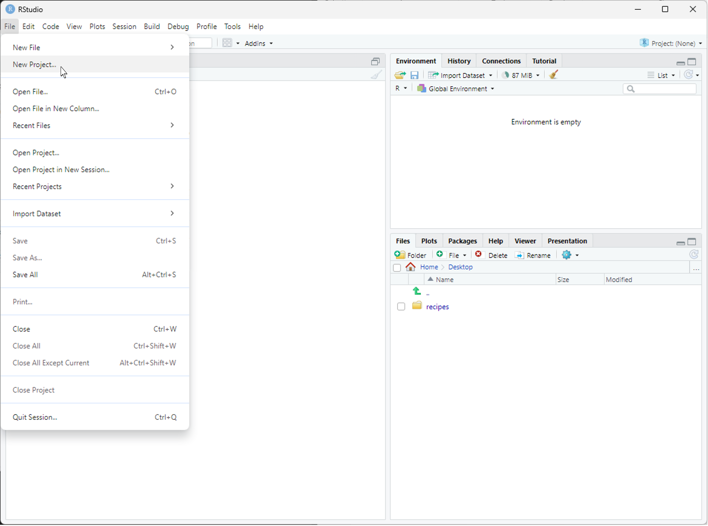
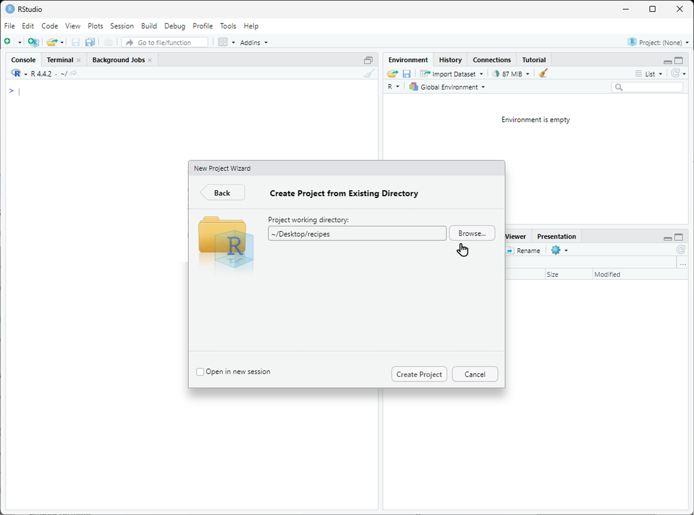
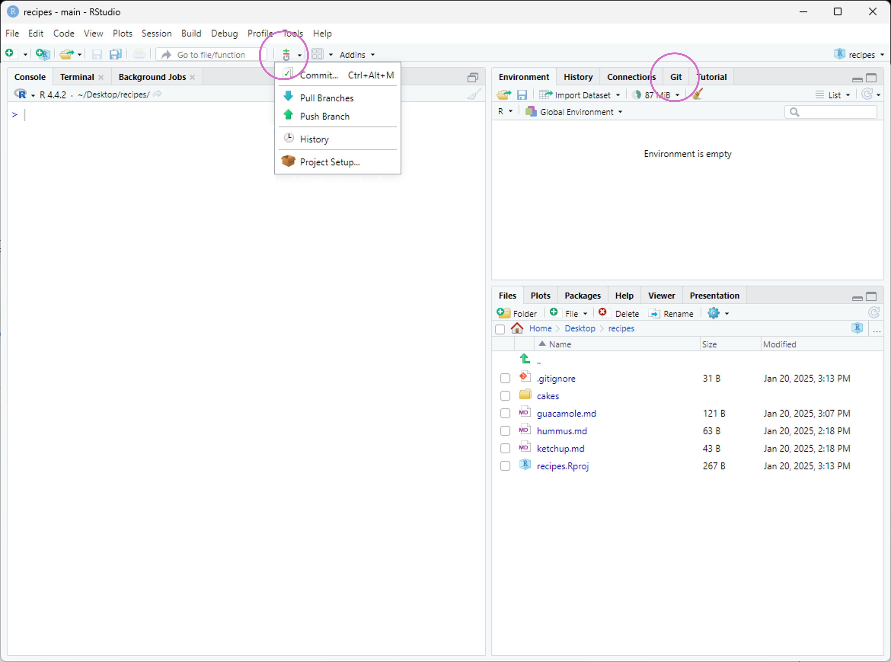
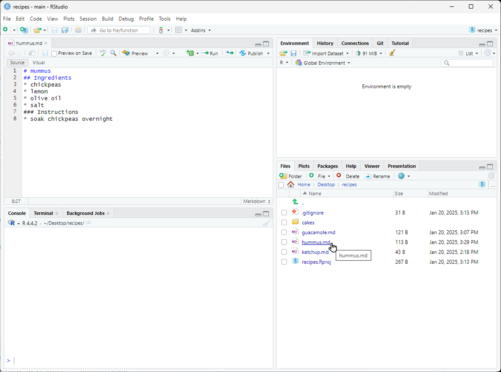
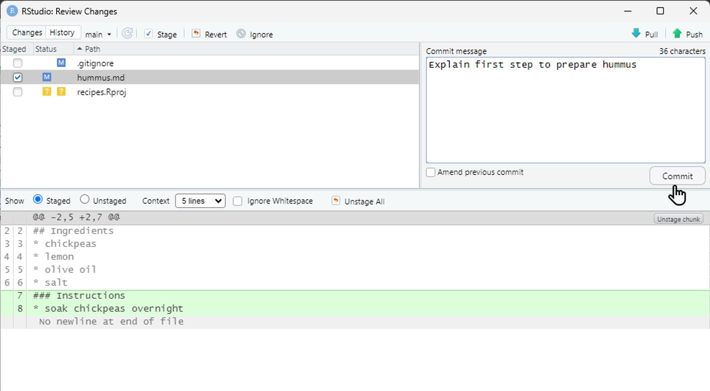
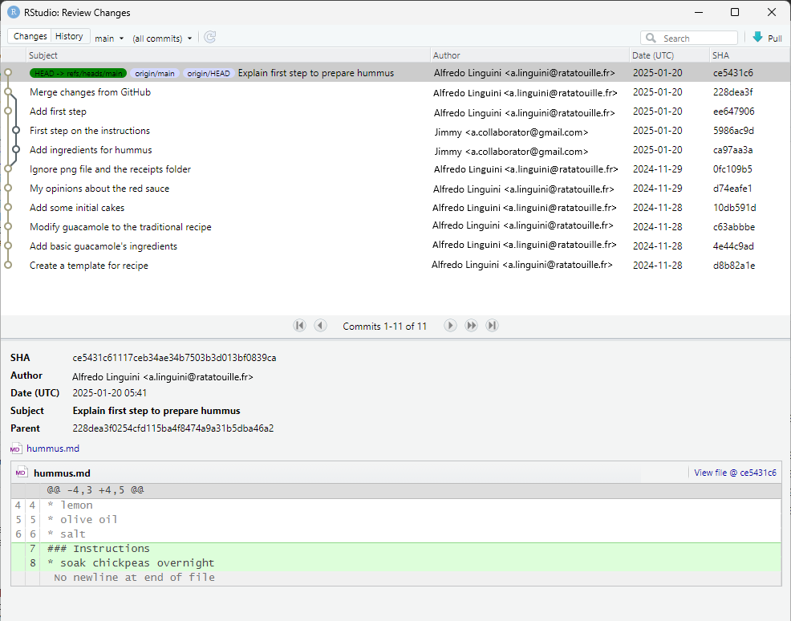

Version control can be very useful when developing data analysis scripts. For
that reason, the popular development environment
[RStudio][rstudio] for the R programming language has built-in
integration with Git. While some advanced Git features still require the
command-line, RStudio has a nice interface for many common Git operations.

RStudio allows us to create a [project][rstudio-projects] associated with a
given directory to keep track of various related files. To be able to track the
development of the project over time, to be able to revert to previous
versions, and to collaborate with others, we version control the Rstudio
project with Git. To get started using Git in RStudio, we create a new project:



This will open a dialog asking us how we want to create the project. We have
some options here. Let's say that we want to use RStudio with the planets
repository that we already made. Since that repository lives in a directory on
our computer, we choose the option "Existing Directory":


> ## Do You See a "Version Control" Option?
>
> Although we're not going to use it here, there should be a "version control"
> option on this menu. That is what you would click on if you wanted to
> create a project on your computer by cloning a repository from GitHub.
> If that option is not present, it probably means that RStudio doesn't know
> where your Git executable is. See
> [this page](https://stat545-ubc.github.io/git03_rstudio-meet-git.html)
> for some debugging advice. Even if you have Git installed, you may need
> to accept the XCode license if you are using macOS.
{: .callout}

Next, RStudio will ask which existing directory we want to use. Click
"Browse..." and navigate to the correct directory, then click "Create Project":



Ta-da! We have created a new project in RStudio within the existing planets
repository. Notice the vertical "Git" menu in the menu bar. RStudio has
recognized that the current directory is a Git repository, and gives us a
number of tools to use Git:



To edit the existing files in the repository, we can click on them in the
"Files" panel on the lower right. Now let's add some additional information
about Pluto:



Once we have saved our edited files, we can use RStudio to commit the changes
by clicking on "Commit..." in the Git menu:


This will open a dialogue where we can select which files to commit (by
checking the appropriate boxes in the "Staged" column), and enter a commit
message (in the upper right panel). The icons in the "Status" column indicate
the current status of each file. Clicking on a file shows information about
changes in the lower panel (using output of `git diff`). Once everything is the
way we want it, we click "Commit":



The changes can be pushed by selecting "Push Branch" from the Git menu. There
are also options to pull from the remote repository, and to view the commit
history:


> ## Are the Push/Pull Commands Grayed Out?
>
> Grayed out Push/Pull commands generally mean that RStudio doesn't know the
> location of your remote repository (e.g. on GitHub). To fix this, open a
> terminal to the repository and enter the command: `git push -u origin
> master`. Then restart RStudio.
{: .callout}

If we click on "History", we can see a graphical version of what `git log`
would tell us:



RStudio creates a number of files that it uses to keep track of a project. We
often don't want to track these, in which case we add them to our `.gitignore`
file:


> ## Tip: versioning disposable output
>
> Generally you do not want to version control disposable output (or read-only
> data). You should modify the `.gitignore` file to tell Git to ignore these
> files and directories.
{: .callout}

> ## Challenge
>
> 1. Create a new directory within your project called `graphs`.
> 2. Modify the `.gitignore` so that the `graphs` directory is not version controlled.
>
> Add the newly created folders to version control using
> the Git interface.
>
> > ## Solution to Challenge
> >
> > This can be done with the command line:
> > ```
> > $ mkdir graphs
> > $ echo "graphs/" >> .gitignore
> > ```
> > {: . shell}
> {: .solution}
{: .challenge}

There are many more features in the RStudio Git menu, but these should be
enough to get you started!


[rstudio]: https://www.rstudio.com/
[rstudio-projects]: https://support.rstudio.com/hc/en-us/articles/200526207-Using-Projects
