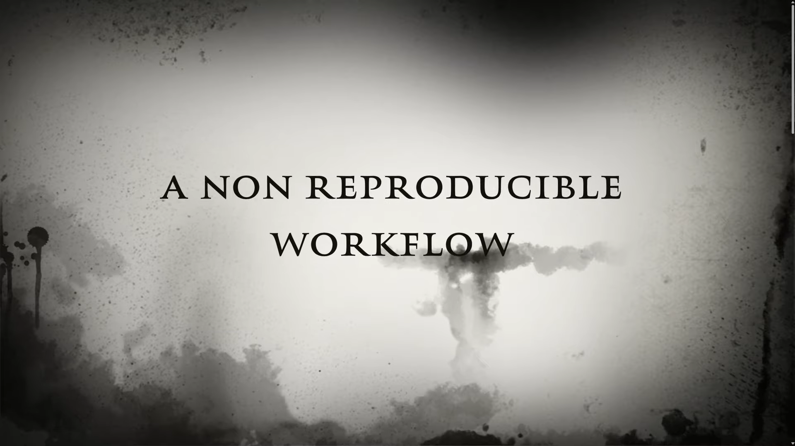

> Do you want to participate in a live workshop? 
> [Sign up in our announcement page!](https://epiverse-trace.github.io/learn/git-training-01/)

## Motivation

Reproducible science not only reduce errors, but speeds up the process of re-runing your analysis and auto-generate updated documents with the results. **Git is an essential part of this process!**

{alt='Video: A Non Reproducible Workflow'}

## The scenario

, created with [Bing Image Creator powered by DALL·E 3](https://www.bing.com/create)](episodes/fig/wolfman_dracula-03.jpg){alt='wolfman and dracula using computers for data analysis'}

Wolfman and Dracula have been hired as data analysts by Outbreak Missions (a Rapid Support Team for outbreak response services) to investigate a disease outbreak. 
They want to be able to work on the development of a reproducible [Situation report](https://choleraoutbreak.org/book-page/appendix-7-outline-outbreak-situation-report) 
at the same time, but they have run into
problems doing this in the past.  

- If they take turns, each one will
spend a lot of time waiting for the other to finish, but 
- if they work on their own copies and email changes back and forth things will be
lost, overwritten, or duplicated.

A colleague suggests using [version control](learners/reference.md#version-control) to
manage their work! 

<!--
Version control is better than mailing files back and forth:

- Nothing that is committed to version control is ever lost, unless
  you work really, really hard at it. Since all old versions of
  files are saved, it's always possible to go back in time to see
  exactly who wrote what on a particular day, or what version of a
  program was used to generate a particular set of results.

- As we have this record of who made what changes when, we know who to ask
  if we have questions later on, and, if needed, revert to a previous
  version, much like the "undo" feature in an editor.

- When several people collaborate in the same project, it's possible to
  accidentally overlook or overwrite someone's changes. The version control
  system automatically notifies users whenever there's a conflict between one
  person's work and another's.

Teams are not the only ones to benefit from version control: lone
researchers can benefit immensely.  Keeping a record of what was
changed, when, and why is extremely useful for all researchers if they
ever need to come back to the project later on (e.g., a year later,
when memory has faded).

Version control is the lab notebook of the digital world: it's what
professionals use to keep track of what they've done and to
collaborate with other people.  Every large software development
project relies on it, and most programmers use it for their small jobs
as well.  And it isn't just for software: books,
papers, small data sets, and anything that changes over time or needs
to be shared can and should be stored in a version control system.
-->

::::::::::::::::::::::::::::::::::::::::::  prereq

## Prerequisites

In this lesson we use Git from Rstudio.
Some previous experience with R and Bash is expected,
*but isn't mandatory*.

::::::::::::::::::::::::::::::::::::::::::::::::::

