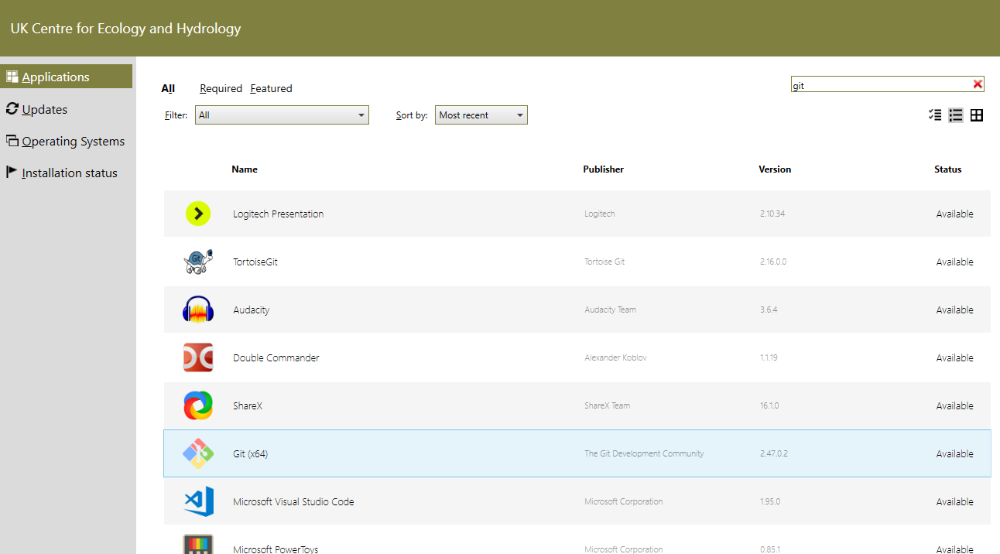
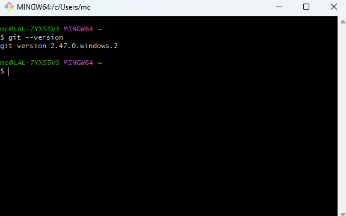

## Installing Git

### Installing Git on UKCEH Laptops
Git can be installed on UKCEH laptops through the Software Centre. 

1. Open the software center and type `git` in the search bar in the top-right. 
2. Locate Git on the list, click on it, and then click "Install".



> This will install Git and other utilities on your system, including GitBash. GitBash is a [BASH](https://www.gnu.org/software/bash/manual/bash.html) emulator that we will use to provide a UNIX like command line to work with during the course of this carpentry course.

3. Check the installation has been successful by opening the start menu, typing `gitbash` in the search bar and hitting enter. 
4. You should be greeted by a small, black, command line window. Type `git --version` and hit enter, you should receive similar information as below:



### Other Systems
If you are using your own machine or a virtual machine, please refer to the carpentries instructions for installing Git on your chosen platform:
- [Git installation on Windows][workshop-setup]
- [Git installation on MacOS][workshop-setup]
- [Git installation on Linux][workshop-setup]

## Creating a GitHub Account

You will need an account for [GitHub](https://github.com) to follow episodes 7 & 8 in this lesson.

1. Go to <https://github.com> and follow the "Sign up" link at the top-right of the window.
2. Follow the instructions to create an account.
3. Verify your email address with GitHub.
4. Configure multifactor authentication (see below).

### Multi-factor Authentication

In 2023, GitHub introduced a requirement for 
all accounts to have 
[multi-factor authentication (2FA)](https://docs.github.com/en/authentication/securing-your-account-with-two-factor-authentication-2fa/about-two-factor-authentication) 
configured for extra security.
Several options exist for setting up 2FA, which are summarised here:

1. If you already use an authenticator app, 
   like [Google Authenticator](https://support.google.com/accounts/answer/1066447?hl=en&co=GENIE.Platform%3DiOS&oco=0) 
   or [Duo Mobile](https://duo.com/product/multi-factor-authentication-mfa/duo-mobile-app) on your smartphone for example, 
   [add GitHub to that app](https://docs.github.com/en/authentication/securing-your-account-with-two-factor-authentication-2fa/configuring-two-factor-authentication#configuring-two-factor-authentication-using-a-totp-mobile-app).
2. If you have access to a smartphone but do not already use an authenticator app, install one and 
   [add GitHub to the app](https://docs.github.com/en/authentication/securing-your-account-with-two-factor-authentication-2fa/configuring-two-factor-authentication#configuring-two-factor-authentication-using-a-totp-mobile-app).
3. If you do not have access to a smartphone or do not want to install an authenticator app, you have two options:
    1. [set up 2FA via text message](https://docs.github.com/en/authentication/securing-your-account-with-two-factor-authentication-2fa/configuring-two-factor-authentication#configuring-two-factor-authentication-using-text-messages) 
       ([list of countries where authentication by SMS is supported](https://docs.github.com/en/authentication/securing-your-account-with-two-factor-authentication-2fa/countries-where-sms-authentication-is-supported)), or
    2. [use a hardware security key](https://docs.github.com/en/authentication/securing-your-account-with-two-factor-authentication-2fa/configuring-two-factor-authentication#configuring-two-factor-authentication-using-a-security-key) 
       like [YubiKey](https://www.yubico.com/products/yubikey-5-overview/) 
       or the [Google Titan key](https://store.google.com/us/product/titan_security_key?hl=en-US&pli=1).

The GitHub documentation provides [more details about configuring 2FA](https://docs.github.com/en/authentication/securing-your-account-with-two-factor-authentication-2fa/configuring-two-factor-authentication).

## GitHub Organisations

There are several UKCEH organisations you may want to join once you have created a GitHub account. To join any of these GitHub organisations please reach out to the relevant contact: 
- [NERC-CEH](https://github.com/NERC-CEH) (contact [Rod Scott](https://github.com/rodscott))
- [ukceh-rse](https://github.com/ukceh-rse) (contact [Joe Marsh Rossney](https://github.com/jmarshrossney))

This is entirely optional and this course can be completed without joinging these organisation, but we do recommend this so you can get visibility on what others are doing at UKCEH. 

----------------

## Preparing Your Working Directory

We'll do our work in the `Desktop` folder so make sure you change your working directory to it with:

```bash
$ cd
$ cd Desktop
```

[workshop-setup]: https://carpentries.github.io/workshop-template/install_instructions/#git

